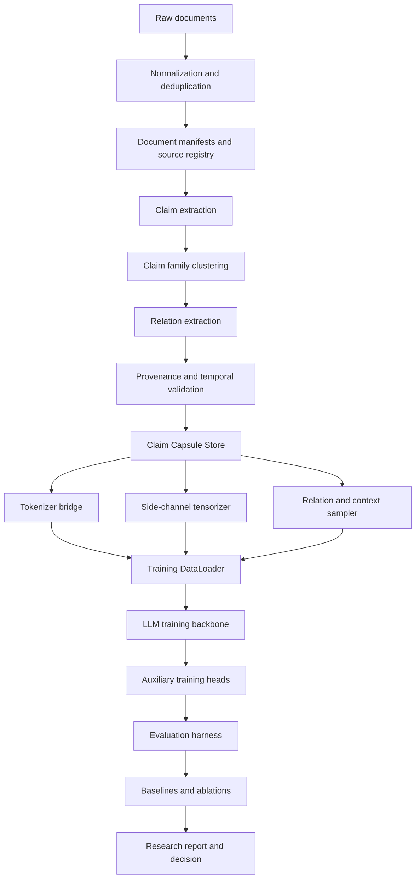

# Axiom

**Experimental LLM training framework for claim-centric pretraining and structured epistemic data substrates beyond flat token streams.**

Axiom is an open-source research framework for building, training, and evaluating language models on structured knowledge substrates instead of plain, unannotated token streams.

The central idea is simple: modern LLMs are usually pretrained on flattened documents, while the actual structure of knowledge is richer. Scientific and technical knowledge is made of claims, evidence, contradictions, provenance, uncertainty, temporal drift, redundancy, and context-dependent interpretation. Axiom turns these structures into first-class training data.

The project explores whether LLM pretraining can become more data-efficient, better calibrated, more provenance-aware, and more robust at scientific reasoning by exposing this structure directly to the training pipeline.

---

## Status

Axiom is an early-stage research framework.

It is intended to become a real training stack, not a toy demo. The first milestone is a strict data contract, reproducible storage layer, and falsification-first evaluation pipeline. Model training components are built only after the substrate is validated and versioned.

APIs, schemas, and package names may change before the first stable release.

---

## Why this project exists

Most pretraining pipelines transform documents like this:

```text
raw document -> cleaned text -> token sequence -> next-token prediction
```

Axiom starts from a different assumption:

```text
raw documents
  -> normalized sources
  -> claims
  -> claim families
  -> provenance-aware claim capsules
  -> training streams and side-channel tensors
  -> model training and falsification
```

The goal is not to replace next-token prediction. The goal is to augment it with structured signals that are normally implicit, noisy, or lost during preprocessing.

A model should not only learn that a sentence is likely. It should also learn whether the sentence is a stable claim, a disputed claim, an outdated claim, a weakly supported claim, a claim with strong independent evidence, or a claim whose meaning changes across contexts.

---

## Core idea

Axiom represents pretraining data as **claim fields**.

A claim field is a structured, time-aware representation of knowledge. It contains claim identities, textual views, provenance, evidence, uncertainty, relations, context, and training targets.

At the center of the framework is the **Claim Capsule**: a self-contained unit of training data that keeps raw text and structured knowledge together.

A simplified capsule looks like this:

```json
{
  "capsule_id": "claim_family:example:0001",
  "claim": {
    "text": "A specific method improves performance under a defined condition.",
    "domain": ["machine_learning"],
    "time": "2026-01-01"
  },
  "views": {
    "source_spans": ["..."],
    "neutral_summary": "...",
    "technical_summary": "...",
    "counterargument": "...",
    "limitations": "..."
  },
  "epistemic_state": {
    "evidence": 0.72,
    "stability": 0.58,
    "novelty": 0.41,
    "uncertainty": 0.33,
    "redundancy": 2.8
  },
  "provenance": {
    "sources": ["..."],
    "licenses": ["..."],
    "cutoff_time": "2026-01-01"
  },
  "relations": [
    {
      "type": "supports",
      "target": "claim_family:example:0002",
      "confidence": 0.81
    },
    {
      "type": "contradicts",
      "target": "claim_family:example:0003",
      "confidence": 0.64
    }
  ],
  "training_targets": {
    "next_token": true,
    "future_summary": true,
    "relation_prediction": true,
    "provenance_recovery": true,
    "uncertainty_calibration": true
  }
}
```

This schema is only illustrative. The implemented schema is versioned and validated in code.

---

## What Axiom is

Axiom is designed to be:

- a data-contract-first framework for structured LLM pretraining;
- a claim-centric substrate builder for scientific and technical corpora;
- a storage and validation layer for provenance-aware training data;
- a bridge between structured data and token-based training networks;
- a falsification harness for comparing structured pretraining against strong baselines;
- a research platform for testing whether richer training data formats improve LLM behavior.

---

## What Axiom is not

Axiom is not:

- a finished foundation model;
- a benchmark leaderboard project;
- a simple RAG pipeline;
- a replacement for PyTorch, JAX, DeepSpeed, Megatron, or FSDP;
- a claim that structured pretraining is already proven;
- a framework that treats popularity, citation count, or repetition as truth.

The project is explicitly experimental. Negative results are useful results.

---

## Architecture



The architecture separates the project into independently testable layers:

```text
source data -> claim field substrate -> training bridge -> model training -> falsification
```

This separation is intentional. The framework should make it possible to improve or replace one layer without blocking the others.

---

## Design principles

### 1. Data contract first

The first stable object in the project is the data schema. Model experiments are not meaningful if the training substrate is vague, inconsistent, or impossible to reproduce.

### 2. Raw text is never discarded

Structured representations can be wrong. Every capsule must preserve enough source grounding to audit, repair, or regenerate the structured fields.

### 3. Provenance is part of the data

Sources, licenses, timestamps, extraction methods, and transformation history are not metadata afterthoughts. They are part of the training substrate.

### 4. Time matters

Axiom treats temporal leakage as a first-class failure mode. A model must not receive future evidence when training or evaluating a past claim state.

### 5. Uncertainty is trainable

The framework represents uncertainty, evidence strength, contradiction, and stability as explicit signals where possible. The goal is better calibration, not just better recall.

### 6. Falsification before scale

The framework must beat strong baselines before advanced architecture claims are taken seriously. Flat-text baselines, structured-text baselines, relation ablations, context shuffles, and popularity controls are required.

### 7. No hard-coded victory

The framework must not bake the target hypothesis into the loss function and then rediscover it. Effects should be estimated on held-out data and tested against controls.

---

## Planned components

```text
src/axiom/
  schema/              Versioned data contracts for capsules, claims, relations, and manifests
  store/               JSONL, Parquet, and manifest-backed storage layers
  ingest/              Source ingestion, normalization, hashing, and deduplication
  extraction/          Claim extraction and textual view generation interfaces
  clustering/          Claim-family clustering and semantic grouping
  relations/           Support, contradiction, supersession, and reuse relation builders
  tensorize/           Conversion from capsules into model-ready tensors
  data/                Dataset, sampler, collator, and training stream logic
  training/            Training-loop adapters and auxiliary objective wiring
  evaluation/          Baselines, ablations, contamination checks, and metrics
  cli/                 Command-line interface
  research/            Experiment manifests, reports, and reproducibility utilities

docs/
  source-material/     Project source documents and research notes
  architecture/        Architecture decisions and design rationale
  protocols/           Data, training, and evaluation protocols

configs/
  data/                Data pipeline configs
  training/            Training configs
  evaluation/          Evaluation configs

tests/
  fixtures/            Small deterministic test fixtures only
  unit/                Unit tests
  integration/         Integration tests
```

Small fixtures may exist for testing, but the project is not organized around demos. The main path is production-grade research infrastructure.

---

## Target technology stack

Axiom is Python-first.

The current project baseline is:

```text
Python >=3.14,<3.15
PyTorch
Pydantic v2
PyArrow / Parquet
Polars
DuckDB
Hugging Face tokenizers and datasets
Ruff
Mypy
Pytest
GitHub Actions
```

Distributed training support is expected to integrate with established systems rather than reimplement them from scratch. Candidate integrations include PyTorch FSDP, DeepSpeed, Megatron-style training, and accelerator-specific backends.

---

## Installation

The exact installation command may change before the first release. The intended local development flow is:

```bash
git clone https://github.com/<owner>/<repo>.git
cd <repo>
uv sync --python 3.14
uv run pytest
```

Alternative pip-based development setup:

```bash
python3.14 -m venv .venv
source .venv/bin/activate
pip install -e ".[dev]"
pytest
```

---

## Target CLI

The CLI is expected to support workflows like:

```bash
axiom validate data/capsules/train.jsonl
axiom manifest build data/raw --output data/manifests/raw.json
axiom capsules build configs/data/build_claim_capsules.yaml
axiom capsules inspect data/capsules/train.jsonl --id claim_family:example:0001
axiom tensorize configs/training/tensorize.yaml
axiom evaluate configs/evaluation/flat_vs_capsule.yaml
```

These commands describe the intended interface. The implemented CLI should document which commands are currently available.

---

## Evaluation philosophy

Axiom is not successful just because it creates more structured data.

The core research question is whether structured claim-field pretraining improves model behavior under fair comparison.

Required comparisons include:

| Comparison | Purpose |
|---|---|
| Flat text baseline | Tests whether structure helps beyond ordinary pretraining. |
| Structured text baseline | Tests whether gains come merely from summaries, FAQs, or rewritten text. |
| Capsule model | Tests the full claim-field substrate. |
| No-provenance ablation | Tests whether source grounding matters. |
| No-relation ablation | Tests whether relation structure matters. |
| Context-shuffle control | Tests whether context labels carry real signal. |
| Popularity / frequency controls | Tests whether the system confuses repetition with truth. |
| Temporal leakage audit | Tests whether future information entered the past. |

A result is only meaningful if it survives strong controls.

---

## Research roadmap

The project is organized around five concrete milestones.

| Milestone | Deliverable |
|---:|---|
| 1 | Repository foundation, schema, storage layer, validation, manifests, tests, and CI. |
| 2 | Claim-field substrate builder: documents to claims, claim families, relations, provenance, and capsules. |
| 3 | Training bridge: tokenizer integration, Dataset, DataLoader, collator, side-channel tensors, and baseline streams. |
| 4 | Falsification harness: baselines, ablations, context shuffle, popularity controls, temporal audits, and metrics. |
| 5 | First full experiment: run, analyze, report, and decide whether to scale, redesign, or reject hypotheses. |

The project should not skip directly to large training runs. The substrate and evaluation protocol must be credible first.

---

## Repository source material

Research notes, design documents, and source material should live under:

```text
docs/source-material/
```

These files are part of the project's intellectual background, but the runtime code should depend on stable schemas and protocols, not on informal notes.

Recommended derived documents:

```text
ARCHITECTURE.md
DATA_CONTRACT.md
RESEARCH_PROTOCOL.md
EVALUATION_PROTOCOL.md
PROJECT_KNOWLEDGE.md
```

---

## Contributing

Contributions are welcome once the initial data contract and repository structure are stable.

Useful contribution areas include:

- schema review;
- source manifest design;
- claim extraction interfaces;
- provenance and license tracking;
- temporal leakage detection;
- dataset and collator implementation;
- PyTorch training integration;
- evaluation metrics;
- ablation design;
- documentation and reproducibility tooling.

Please keep contributions aligned with the core project discipline: reproducibility, falsification, explicit assumptions, and no unsupported claims.

---

## Development standards

All code should be typed, tested, and formatted.

Expected checks:

```bash
ruff check .
ruff format --check .
mypy src
pytest
```

Any generated dataset artifact should have a manifest, hash, source reference, timestamp policy, and reproducibility note.

---

## License

This project is intended to be released as open source. Apache License 2.0 is recommended for a training framework, but the final license should be confirmed before the first public release.

---

## Citation

If you use Axiom in research, please cite the repository and the relevant experiment reports once public releases are available.

A `CITATION.cff` file should be added before the first stable research release.

---

## Research disclaimer

Axiom is an experimental research framework. It does not claim that claim-centric pretraining is superior by default. The purpose of the project is to build the infrastructure required to test that hypothesis seriously.

The best outcome is not a predetermined positive result. The best outcome is a reproducible answer.
