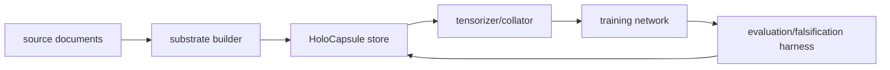

# Architecture

Step 1 establishes the repository constitution and the HoloCapsule data
contract. Later stages will add substrate building, tensorization, model
training, and falsification-oriented evaluation, but those stages depend on this
schema remaining strict and reproducible.

## Intended Full System

## Step 1 Boundary

Step 1 owns:

- canonical Pydantic schema models;
- deterministic identifier, timestamp, enum, and scalar validation;
- JSONL storage with streaming validation;
- Parquet storage for flat inspection columns plus canonical nested JSON;
- manifest generation with content hashes;
- documentation, tests, linting, typing, and CI.

Step 1 does not own:

- source ingestion or claim extraction;
- external LLM calls;
- tokenizer integration;
- model training;
- benchmark claims.

## Data Flow Contract

Source material is normalized into future `SourceDocument` and `DocumentSpan`
records. A substrate builder will later transform those records into
`HoloCapsule` objects. The store writes capsules as immutable JSONL or Parquet
artifacts and produces manifests that record file hashes and counts. Tensorizers
must consume validated capsules only, so data leakage and schema violations are
caught before training.

## Storage Roles

JSONL is the canonical inspection and interchange format for Step 1. Each line is
one complete capsule and validates independently.

Parquet is provided as an analytical bridge. Step 1 stores simple flat columns
and the canonical nested record as `record_json`; native nested Arrow layouts are
deferred until training and analytics requirements are clearer.

Manifests are content-addressed dataset receipts. They track hashes, sizes,
record counts, schema versions, and source documents.
