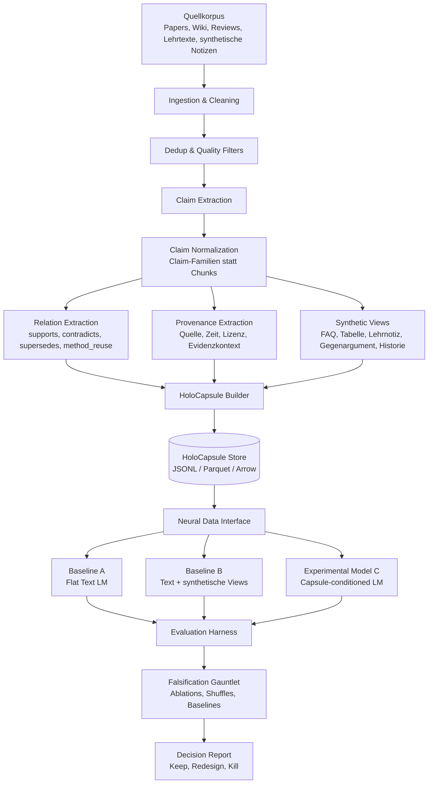
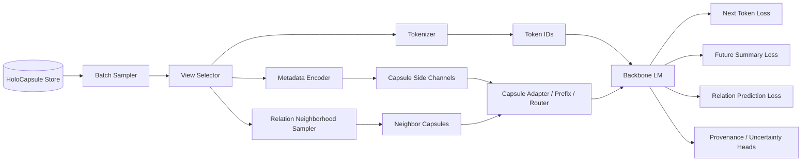

# HoloCapsule Claim-Field Pretraining

**Fachliche Architektur, MVP-Schnitt und Arbeitsplan**  
Version: 0.1  
Status: Architektur- und PoC-Startdokument

---

## 1. Mission

Wir bauen kein neues Frontier-LLM. Wir bauen ein **testbares Forschungsframework**, mit dem geprüft werden kann, ob ein anderes Trainingsdaten-Substrat einen messbaren Vorteil gegenüber klassischem flachem Text-Pretraining erzeugt.

Die zentrale Hypothese:

> Ein Modell, das bei gleicher Tokenmenge und gleichem Compute auf strukturierten Claim-Field-Kapseln trainiert wird, zeigt bessere epistemische Kompetenz als ein Modell, das dieselben Inhalte nur als flache Tokenfolge sieht.

Unter **epistemischer Kompetenz** verstehen wir im MVP nicht allgemeine Intelligenz, sondern konkret messbare Fähigkeiten:

- stabile vs. spekulative Aussagen unterscheiden,
- Evidenz, Provenienz und Unsicherheit mitgenerieren,
- Widersprüche erkennen,
- historische Wissensrevisionen korrekt behandeln,
- Claim-Familien statt bloße Dokumentchunks modellieren,
- Relationstypen wie `supports`, `contradicts`, `supersedes`, `method_reuse` nutzen,
- dieselbe Wissenseinheit über mehrere Oberflächenformen hinweg konsistent halten.

Die Arbeit ist **falsifikationsorientiert**: Der Ansatz gilt erst dann als interessant, wenn er starke Baselines, Shuffles und Ablationen schlägt. Kein Teil des MVP soll HKR oder HoloCapsule-Pretraining „beweisen“. Das Ziel ist ein reproduzierbarer Test auf zusätzlichen Vorhersage- und Lernwert.

---

## 2. Kernentscheidung: Python als primäre Sprache

**Entscheidung:** Python 3.14+ als Hauptsprache.

Begründung:

- PyTorch, Hugging Face, PyTorch Lightning/Accelerate, DeepSpeed/FSDP, Tokenizer, Dataset- und Evaluation-Ökosystem sind bereits vorhanden.
- Für den MVP sind schnelle Iteration, GPU-Zugriff und Experimentierbarkeit wichtiger als maximale Systemperformance.
- Die Kernidee liegt im Datenformat, in der Trainingsschnittstelle und in den Losses; dafür ist Python die kürzeste Strecke zu einem testbaren Ergebnis.
- Performancekritische Komponenten können später ausgelagert werden: Rust für Parser/Indexer, C++/CUDA/Triton für Spezialkernel, DuckDB/Polars/Arrow für analytische Datenpfade.

**Nicht-Ziel im MVP:** Eigene GPU-Kernel, eigener Transformer-Stack, eigenes verteiltes Trainingsframework.

**Technischer Default-Stack:**

```text
Python 3.14+
PyTorch
Pydantic v2 oder dataclasses für HoloCapsule-Schemas
PyArrow / Parquet / JSONL für persistente Kapseln
Polars oder DuckDB für Datenanalyse
Hugging Face tokenizers / datasets als pragmatische Brücke
pytest für Tests
Hydra oder Typer für CLI-Konfiguration
Rich für lokale Reports
optional: Weights & Biases, MLflow oder TensorBoard für Experimenttracking
optional: PyTorch Geometric für Relation-/Graph-Ablationen
```

---

## 3. Fachliches Architekturdiagramm



---

## 4. Trainingsnetzwerk-Anbindung

Der entscheidende MVP-Baustein ist nicht sofort ein großes Modell, sondern das **Neural Data Interface**: ein Data Loader, der dieselbe Wissenseinheit in mehreren Formen an das Modell liefern kann.



Für den MVP gibt es drei Eskalationsstufen:

1. **No-architecture-change:** Kapselmetadaten werden als spezielle Textpräfixe in den Tokenstrom serialisiert.
2. **Light adapter:** Kapselmetadaten werden als kleine Side-Channel-Embeddings in einen Adapter oder Prefix-Mechanismus eingespeist.
3. **Experimental router:** Epistemischer Zustand steuert später Routing, Expertenauswahl oder Loss-Masking.

Die erste Stufe ist absichtlich simpel. Sie erlaubt schnelle Baselines und verhindert, dass Architekturkomplexität die eigentliche Frage verdeckt.

---

## 5. HoloCapsule-Datenformat v0

```json
{
  "capsule_id": "claim_family:example:0001",
  "claim_family_id": "cf_0001",
  "version": "0.1",
  "language": "de",
  "domain": ["science", "medicine"],
  "time": {
    "source_date": "1984-01-01",
    "observation_cutoff": "1995-01-01"
  },
  "claim": {
    "canonical_text": "Helicobacter pylori contributes causally to peptic ulcer disease.",
    "claim_type": "causal_scientific_claim",
    "scope": "human medicine",
    "status_label": "established_after_revision",
    "confidence": 0.84
  },
  "surface_views": {
    "original_spans": [],
    "short_summary": "...",
    "teaching_note": "...",
    "faq": [],
    "table": [],
    "counterargument": "...",
    "historical_update": "..."
  },
  "epistemic_state": {
    "O": 0.72,
    "E": 0.81,
    "T": 0.66,
    "R": 5.2,
    "uncertainty": 0.18,
    "stability": "rising_to_established"
  },
  "relations": [
    {
      "type": "supports",
      "target": "cf_0002",
      "confidence": 0.77,
      "evidence_span_id": "span_01"
    },
    {
      "type": "contradicts",
      "target": "cf_0003",
      "confidence": 0.62,
      "evidence_span_id": "span_02"
    }
  ],
  "provenance": {
    "sources": [],
    "license": "unknown",
    "generation_method": "manual_or_model_assisted",
    "extractor_version": "extractor_v0"
  },
  "training_targets": {
    "next_text": "...",
    "future_summary": "...",
    "relation_labels": [],
    "provenance_labels": [],
    "stability_target": "established"
  }
}
```

---

## 6. MVP-Schnitt: Was wird wirklich getestet?

### Baseline A: Flat Text

Dieselbe Informationsmenge wird als normaler Text trainiert.

```text
<document_text>
```

### Baseline B: Structured Text Views

Das Modell sieht dieselben Inhalte als strukturierte, aber noch rein textuelle Formen.

```text
[CLAIM]
...

[EVIDENCE]
...

[COUNTERARGUMENT]
...

[SUMMARY]
...
```

### Experimental C: HoloCapsule-conditioned

Das Modell sieht Text plus maschinenlesbare Kapselstruktur oder Side Channels.

```text
<CAPSULE id="cf_0001" status="rising_to_established" uncertainty="0.18">
[CLAIM] ...
[RELATION supports cf_0002]
[RELATION contradicts cf_0003]
[PROVENANCE] ...
[TEXT] ...
</CAPSULE>
```

Oder später:

```text
tokens + metadata_tensor + relation_neighbors + loss_masks
```

---

## 7. Module und unabhängige Arbeitspakete

Die Arbeit wird so geschnitten, dass einzelne Teile unabhängig vorankommen können.

### WP0: Repository und Projektstandard

**Ziel:** Saubere Grundlage für Codex, Tests und Experimente.

**Outputs:**

- `pyproject.toml`
- `README.md`
- `ARCHITECTURE.md`
- `src/hcaps/`
- `tests/`
- `examples/`
- `configs/`

**Kann unabhängig starten:** ja.

---

### WP1: HoloCapsule Schema

**Ziel:** Pydantic- oder dataclass-Schema für Kapseln.

**Outputs:**

- `src/hcaps/schema.py`
- JSON Schema Export
- Beispielkapseln in `examples/capsules/*.json`
- Validierungstests

**Kann unabhängig starten:** ja.  
**Blockiert:** Data Loader, Store, Evaluation.

---

### WP2: Store und Serialisierung

**Ziel:** Kapseln robust speichern und laden.

**MVP-Format:** JSONL.  
**Nächstes Format:** Parquet/Arrow.

**Outputs:**

- `src/hcaps/store/jsonl_store.py`
- `src/hcaps/store/parquet_store.py` optional
- CLI: `hcaps validate`, `hcaps inspect`, `hcaps stats`

**Kann unabhängig starten:** nach WP1-Minimalschema.

---

### WP3: Capsule Builder

**Ziel:** Aus Rohtexten erste Kapseln erzeugen.

**MVP:** halbautomatisch oder manuell kuratierte Mini-Kapseln.  
**Später:** LLM-gestützte Claim-Extraktion, Relationsextraktion, synthetische Views.

**Outputs:**

- `src/hcaps/builders/manual.py`
- `src/hcaps/builders/llm_assisted.py` optional
- `examples/raw/`
- `examples/capsules/`

**Kann unabhängig starten:** ja, mit Mock-Schema.

---

### WP4: Neural Data Interface

**Ziel:** Kapseln in Trainingsbatches umwandeln.

**Outputs:**

- `src/hcaps/data/dataset.py`
- `src/hcaps/data/collator.py`
- `src/hcaps/data/serialization.py`
- Sampling-Modi:
  - `flat_text`
  - `structured_text`
  - `capsule_serialized`
  - `capsule_side_channel`

**Kann unabhängig starten:** nach WP1/WP2.

---

### WP5: Minimal Training Harness

**Ziel:** Kleine Modelle reproduzierbar trainieren.

**MVP:** Tiny Transformer oder kleine Hugging-Face-kompatible Causal LM.

**Outputs:**

- `src/hcaps/training/train_lm.py`
- `src/hcaps/training/objectives.py`
- Configs für Baseline A/B/C
- Checkpointing
- Seed-Kontrolle

**Kann unabhängig starten:** mit Dummy-Dataset.

---

### WP6: Capsule Adapter / Side Channel

**Ziel:** Nicht nur Textpräfixe, sondern echte Metadatenkopplung testen.

**MVP-Mechanismus:**

- numerische Kapselmerkmale in Embedding projizieren,
- als Prefix-Embedding an den Tokenstrom anhängen,
- optional Loss-Masks pro Ziel.

**Outputs:**

- `src/hcaps/modeling/capsule_adapter.py`
- `src/hcaps/modeling/feature_encoder.py`
- Tests für Shapes und Masking

**Kann unabhängig starten:** nach WP4, parallel zu WP5.

---

### WP7: Evaluation Harness

**Ziel:** Der MVP braucht eigene Tests, nicht nur Perplexity.

**Metriken:**

- Validierungs-Perplexity pro Datenformat,
- Claim-Status-Klassifikation,
- Relation Prediction,
- Contradiction Detection,
- Provenance Recovery,
- Uncertainty Calibration,
- Outdated-Belief QA,
- Counterfactual/Historical Revision QA.

**Outputs:**

- `src/hcaps/eval/tasks.py`
- `src/hcaps/eval/metrics.py`
- `src/hcaps/eval/report.py`
- `reports/*.md`

**Kann unabhängig starten:** mit synthetischem Goldset.

---

### WP8: Falsification Gauntlet

**Ziel:** Verhindern, dass wir uns selbst täuschen.

**Ablationen:**

- Kapselmetadaten zufällig shufflen,
- Relationen entfernen,
- Provenienz entfernen,
- epistemische Werte permutieren,
- gleiche Tokens ohne Struktur trainieren,
- Relation Labels randomisieren,
- zeitliche Cutoffs verletzen als Negativkontrolle,
- gleich viele Parameter und gleiche Tokenmenge erzwingen.

**Outputs:**

- `configs/ablations/*.yaml`
- `src/hcaps/experiments/ablation_runner.py`
- Report: `reports/falsification_gauntlet.md`

**Kann unabhängig starten:** sobald WP5/WP7 minimal laufen.

---

### WP9: Claim-Field Graph optional

**Ziel:** Relationale Nachbarschaft und einfache HKR-nahe Signale testen.

**MVP:** NetworkX oder PyG für kleine Graphen.

**Outputs:**

- Claim-Familien als Knoten,
- Relationstypen als Kanten/Hyperkanten-Approximation,
- einfache Kennzahlen: Community Diversity, Relation Degree, Conflict Degree,
- später: Holonomy/Curvature-Proxies.

**Kann unabhängig starten:** nach WP1/WP2, braucht nicht den LM-Trainingspfad.

---

## 8. Empfohlene Repository-Struktur

```text
holo-capsule-pretraining/
  README.md
  ARCHITECTURE.md
  pyproject.toml
  configs/
    data/
    model/
    train/
    eval/
    ablations/
  examples/
    raw/
    capsules/
    datasets/
  src/
    hcaps/
      __init__.py
      schema.py
      store/
        __init__.py
        jsonl_store.py
      builders/
        __init__.py
        manual.py
      data/
        __init__.py
        dataset.py
        collator.py
        serialization.py
      modeling/
        __init__.py
        capsule_adapter.py
        feature_encoder.py
      training/
        __init__.py
        train_lm.py
        objectives.py
      eval/
        __init__.py
        tasks.py
        metrics.py
        report.py
      experiments/
        __init__.py
        ablation_runner.py
  tests/
    test_schema.py
    test_store.py
    test_dataset.py
    test_collator.py
    test_adapter.py
  reports/
```

---

## 9. MVP-Meilensteine

### M0: Architecture Freeze Lite

**Dauer:** 0.5 bis 1 Tag  
**Ergebnis:** Dieses Dokument plus konkrete Repo-Struktur.

### M1: Schema + Beispielkapseln

**Dauer:** 1 bis 2 Tage  
**Ergebnis:** 20 bis 100 manuell oder halbautomatisch erzeugte Kapseln in JSONL.

### M2: Loader + Serialisierung

**Dauer:** 1 bis 3 Tage  
**Ergebnis:** Flat/Structured/Capsule-Dataset-Modi liefern reproduzierbare Batches.

### M3: Baseline Training

**Dauer:** 2 bis 5 Tage  
**Ergebnis:** Tiny LM auf Baseline A und B trainierbar.

### M4: Capsule-conditioned Training

**Dauer:** 3 bis 7 Tage  
**Ergebnis:** Modell C trainierbar; gleiche Tokens, gleicher Compute, gleiche Parameterordnung.

### M5: Evaluation + Falsification

**Dauer:** 3 bis 10 Tage  
**Ergebnis:** erster Report mit Gewinn/Nullresultat/Ablation.

---

## 10. Minimaler erster Experimentplan

### Datensatz

Ein kleiner, kontrollierbarer Korpus mit 50 bis 500 Claim-Familien.

Geeignete Startdomänen:

- Wissenschaftsgeschichte mit Revisionen,
- Medizinische Dogmen und spätere Korrekturen,
- Physik-/Materialwissenschaftsclaims,
- Software-/ML-Benchmarkclaims,
- Wikipedia-Abschnitte plus Review-/Lehrtext-Zusammenfassungen.

### Modelle

- Tiny Transformer 10M bis 50M Parameter für lokale Debuggability.
- Danach 100M bis 300M Parameter, wenn die Pipeline stabil ist.
- Erst dense, nicht MoE.

### Vergleich

```text
A: Flat Text
B: Structured Text Views
C: Serialized HoloCapsules
D: HoloCapsules + Side Channel Adapter
```

### Erfolgskriterium für den MVP

Der Ansatz muss nicht sofort allgemeine Benchmarks schlagen. Ein gutes erstes Signal wäre:

```text
C oder D > A und B auf Relation Prediction, Contradiction Detection,
Provenance Recovery oder Historical Revision QA,
während Perplexity nicht katastrophal schlechter wird.
```

Ein sehr gutes Signal wäre:

```text
C oder D bleibt besser als A/B,
auch wenn Tokenmenge, Parameterzahl, Trainingsschritte und Dateninhalt kontrolliert werden,
und der Vorteil verschwindet bei Metadata-Shuffle oder Relation-Shuffle.
```

---

## 11. Erste Codex-Aufgabe

Die erste Codex-Aufgabe sollte klein und eindeutig sein:

```text
Implementiere das Python-Projektgerüst für HoloCapsule Claim-Field Pretraining.

Erzeuge:
- pyproject.toml
- src/hcaps/schema.py mit Pydantic-Modellen für HoloCapsule, Claim, Relation, Provenance, EpistemicState, TrainingTargets
- src/hcaps/store/jsonl_store.py zum Laden/Speichern/Validieren von JSONL-Kapseln
- examples/capsules/demo_capsules.jsonl mit 3 validen Beispielkapseln
- tests/test_schema.py
- tests/test_store.py

Anforderungen:
- Python 3.14+
- keine externen LLM-Aufrufe
- pytest muss lokal laufen
- Typisierung verwenden
- klare Fehlermeldungen bei ungültigen Kapseln
```

Danach folgt erst der Data Loader.

---

## 12. Architekturprinzipien

1. **Gleiche Tokens, gleiche Compute-Budgets, gleiche Seeds:** Sonst ist kein fairer Vergleich möglich.
2. **Struktur ist Hypothese, nicht Dekoration:** Jede Kapselkomponente muss ablatierbar sein.
3. **Rohtext bleibt erhalten:** Struktur darf Quelle nicht ersetzen, nur ergänzen.
4. **Provenienz ist first-class:** Jede generierte View muss auf Ursprung und Methode zurückführbar sein.
5. **Keine harte Redundanz-Wahrheitsregel:** Redundanz ist Signal, nicht Wahrheit.
6. **Zeitliche Cutoffs:** Keine zukünftige Information in Trainingszustände vor dem Cutoff.
7. **Erst einfache Serialisierung, dann Side Channels:** Nicht zu früh in Architekturkomplexität fliehen.
8. **Nullresultate sind wertvoll:** Der MVP muss Redesign- und Kill-Kriterien enthalten.

---

## 13. Kill- und Redesign-Kriterien

Der konkrete MVP-Ansatz wird überarbeitet, wenn:

- Capsule C/D nur gewinnt, weil mehr Tokens oder mehr Parameter genutzt werden,
- der Vorteil bei fairer Tokenkontrolle verschwindet,
- Metadata-Shuffle keinen Effekt hat,
- Relation-Shuffle keinen Effekt hat,
- Provenienzfelder nur Rauschen erzeugen,
- die Extraktion zu viele strukturierte Fehler produziert,
- Evaluationen nur Perplexity verbessern, aber keine epistemischen Tasks,
- Baseline B den gesamten Effekt bereits erklärt.

In diesem Fall ist die richtige Reaktion nicht „mehr Komplexität“, sondern ein engerer Test: bessere Labels, kleinere Domäne, stärkere Goldsets, klarere Ablationen.

---

## 14. Offene Designfragen

- Werden HoloCapsules zuerst rein textuell serialisiert oder direkt als Side Channels gekoppelt?
- Wie stark sollen synthetische Views gewichtet werden?
- Soll die erste Domäne Wissenschaftsgeschichte, Medizin oder ML/Software sein?
- Welche Relationstypen reichen für v0?
- Wie messen wir Provenance Recovery ohne zu viel Labeling-Aufwand?
- Wann lohnt ein graphbasierter Relation-Sampler?
- Wann wird HKR-nahe Kurvatur/Holonomie eingebaut: erst nach erfolgreichem Kapsel-MVP oder sofort als optionales Modul?

**Empfehlung:** HKR-nahe Geometrie erst als WP9 optional ergänzen. Der erste wissenschaftlich saubere Schritt ist der Nachweis, dass Claim-Kapseln als Trainingssubstrat überhaupt einen Mehrwert gegenüber flachem Text und strukturierten Textviews liefern.

---

## 15. Nächster Schritt

Direkt nach diesem Architekturfile:

1. Repo anlegen.
2. `pyproject.toml` und Paketstruktur erzeugen.
3. Pydantic-Schema implementieren.
4. Drei Demo-Kapseln validieren.
5. JSONL-Store testen.
6. Danach Data Loader bauen.

Der kleinste sinnvolle Commit heißt:

```text
feat: add HoloCapsule schema and JSONL store
```
