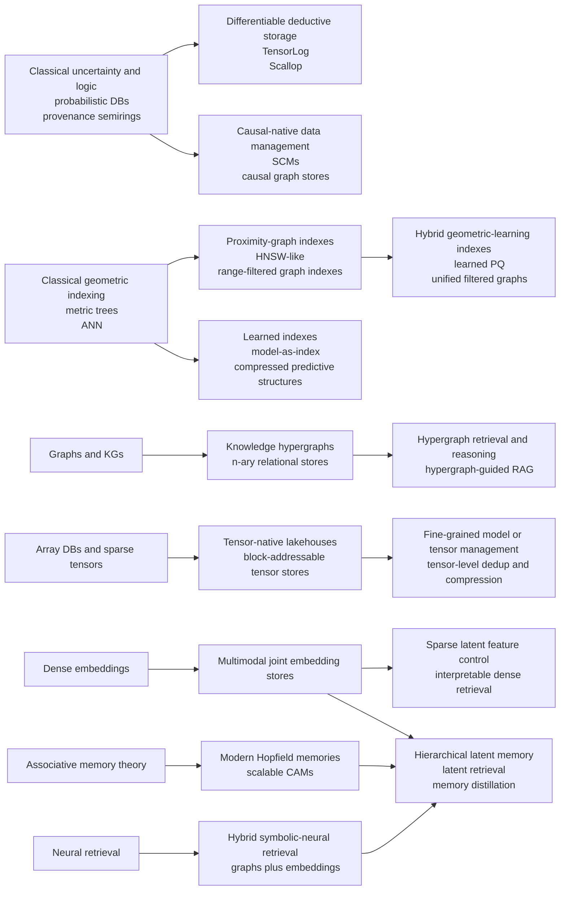

# Research Report on Emerging Complex Data-Storage Methods Beyond Graph and Vector Stores

## Executive summary

The center of gravity in advanced data storage research is shifting from **systems organized around a single data model** toward **storage substrates that are themselves part of the reasoning or learning process**. The newest paradigms do not merely store records, edges, or vectors; they store **higher-order relations, tensor blocks, probabilistic provenance, causal structure, differentiable retrieval mappings, associative memories, or multimodal latent state**. In other words, the storage layer is increasingly becoming a computational object rather than a passive container. Recent work on knowledge hypergraphs, tensor lakehouses, learned and proximity-graph indexes, probabilistic programming over tables, causal graph data management, modern Hopfield memories, latent-space retrieval, and neuro-symbolic retrieval all point in that direction. citeturn20search7turn22view6turn19view0turn32view0turn33view1turn21search0turn16view3turn16view4turn19view4turn23view2turn22view8

No single technique dominates the design space. **Knowledge hypergraphs** are strongest when the data truly have n-ary or higher-order semantics that binary edges compress poorly. **Tensor-native stores** are strongest when the workload is block-addressable numerical data for training, simulation, or model management. **Geometric and learned indexes** offer the best near-term path to very low query latency and compact indexing, but usually at the price of weaker update robustness or weaker semantics. **Probabilistic and causal stores** are unmatched when uncertainty, provenance, interventions, or counterfactuals are first-class, but they remain computationally and systems-wise demanding. **Differentiable and latent-space stores** are appealing for end-to-end learning and agentic workflows, but they are still relatively weak on dynamic updates and transactional guarantees. **Content-addressable and hybrid symbolic-neural memories** are among the most promising for reasoning-intensive AI, but they remain much less mature than relational, document, graph, or vector systems in concurrency control and durability semantics. citeturn29view0turn19view0turn32view0turn33view1turn33view2turn21search0turn22view1turn16view3turn16view4turn16view5turn31search13turn23view2turn19view4turn22view7turn22view8

Across the requested trade-off dimensions, the most important pattern is this: **expressiveness, uncertainty-awareness, and reasoning support tend to increase as update simplicity, transactional clarity, and predictable latency decrease**. Hypergraphs, probabilistic provenance, causal stores, and hybrid symbolic-neural models are richer than standard vector stores, but they are also harder to optimize, compose, and maintain. By contrast, learned indexes and geometric ANNS structures often provide excellent latency and storage efficiency, but they do so by specializing hard to a narrow set of operations rather than broadening semantics. Recent multimodal and hierarchical latent-memory systems try to bridge that gap by combining fast parametric recall, retrieval memory, and explicit structure, but their consistency models remain largely inherited from outer systems rather than intrinsic to the representation itself. citeturn30view0turn17view0turn21search0turn22view5turn16view3turn22view2turn19view3turn28view0turn28view3

For practical research planning, the field appears to separate into three maturity bands. **Most mature**: learned and proximity-graph indexing, probabilistic provenance/circuit methods, and tensor-native block stores. **Rapidly advancing but still structurally unstable**: knowledge hypergraphs, hybrid symbolic-neural retrieval, multimodal joint-embedding stores, and hierarchical latent-memory systems. **Conceptually important but early-stage**: causal-native graph stores and quantum-inspired database representations. That maturity spread should shape expectations: the most semantically ambitious substrates are not yet the ones with the strongest concurrency, maintenance, and operational theory. citeturn17view0turn21search0turn22view1turn22view2turn19view0turn20search7turn22view8turn16view8turn28view0turn16view4turn24view0

## Framing the design space

The right way to read these paradigms is not as a list of substitutes for relational databases, graph stores, or vector databases, but as **research answers to specific failure modes** of those established models. Recent survey work on vector DBMSs is useful as a baseline: it identifies ambiguity of semantic similarity, vector size, expensive similarity computation, lack of structural properties for indexing, and difficulty of hybrid queries that combine attributes with similarity search as five central obstacles in modern unstructured-data management. That is exactly the pressure that has created the newer paradigms reviewed below. citeturn30view0turn30view1turn30view3

The key analytical distinction is between **representation-rich** and **algorithm-rich** storage methods. Representation-rich methods try to encode more of the world directly into the stored object: hyperedges for n-ary relations, tensor blocks for multidimensional numerical state, provenance circuits for uncertainty, structural equations for interventions, or hierarchical memory graphs for lifelong multimodal agents. Algorithm-rich methods instead keep the stored object comparatively simple but innovate on indexing and retrieval: proximity graphs, product quantization, segmented inclusive graphs, learned CDF indexes, generative docid retrieval, or sparse latent features for embedding control. The former tend to improve expressiveness and reasoning support; the latter tend to improve latency and memory efficiency. citeturn20search7turn22view6turn19view0turn16view3turn19view3turn28view0turn33view1turn14search3turn17view0turn16view9

A second distinction is between **intrinsic semantics** and **host-inherited semantics**. In mature database work, consistency and transactions are intrinsic design properties. In much of the current research frontier, however, those guarantees are only partially specified. Tensor stores often rely on lakehouse or object-store semantics, hypergraph retrieval systems often rely on an underlying graph store plus a vector index, and multimodal memory frameworks often layer parametric memory over retrieval memory without introducing a new concurrency-control model. Hence, in the analysis below, “consistency” is split into two questions: what the paradigm means semantically, and what guarantees it actually comes with as a data system. citeturn20search2turn19view0turn32view0turn28view0turn28view3

## Higher-order and tensor-native paradigms

**Knowledge hypergraphs and hypergraph databases** generalize pairwise graphs by allowing a single relation instance to connect many entities at once. Recent hypergraph-based retrieval work is explicit about the motivation: ordinary graph edges are binary, while many real facts are n-ary. HyperGraphRAG uses hyperedges to represent n-ary facts and stores them through a combination of n-ary relation extraction, bipartite hypergraph storage, and vector representation storage. In parallel, relational-hypergraph learning work analyzes expressive power via relational Weisfeiler–Leman and logical expressiveness, showing why higher-order storage is not just a cosmetic extension of graphs. Cross-expansion methods further show that both hypervertices and hyperedges can be embedded in a **joint** space rather than in separate spaces, improving data efficiency and computational efficiency. The natural data model is thus an incidence structure or bipartite expansion with typed hyperedges, and the natural primitives are hyperedge lookup, incidence traversal, hyperedge prediction, relational message passing, and query-conditioned high-order retrieval. Indexing is usually a mix of incidence indexes plus vector retrieval over nodes/hyperedges. Space is typically linear in vertices plus hyperedges plus total incidences, while message passing and many query operations scale with incidence count rather than edge count. Transactional support is generally inherited from the host store rather than native. Uncertainty handling in the recent literature is usually score-based or embedding-based, not first-class probabilistic semantics. For reasoning and ML, however, hypergraphs are among the strongest candidates when the target task truly requires higher-order composition, multi-hop reasoning over n-ary facts, or inductive hyperedge prediction. citeturn20search7turn20search2turn29view0turn22view6turn20search11

**Tensor stores and tensor-native data management** treat storage as a problem of managing multidimensional arrays, sparse tensors, or model parameters directly rather than serializing them into rows or documents. TensorBank is representative of the current research direction: it defines a tensor lakehouse that streams tensor blocks from cloud object storage to GPU memory, uses **Hierarchical Statistical Indices** for query acceleration, directly addresses tensor blocks via HTTP range reads, and prunes irrelevant blocks based on statistics at multiple hierarchical resolutions. Delta Tensor similarly ports multidimensional array strategies and sparse encodings into a lakehouse setting, reporting better space and time efficiency than naïve tensor serialization. The theoretical foundation here comes from array databases, sparse tensor algebra, chunked/block decompositions, and multiresolution summaries. The representation is usually a sparse or dense tensor partitioned into chunks or blocks with block-level metadata. Query primitives are block scan, slicing, masking, blockwise predicate filtering, and transformation-aware data feeding into ML pipelines. With hierarchical summaries, the practical cost is closer to `O(log B + touched_blocks)` than full-object scan, where `B` is the number of indexed blocks; memory scales with nonzeros plus chunk metadata for sparse cases, or with total blocks plus summary structures for dense cases. Consistency is again usually inherited from the surrounding lakehouse/object-store substrate. Uncertainty is not native unless the tensor entries themselves encode distributions. These stores are excellent for ML training, simulation, multimodal preprocessing, and fine-grained model management, but much weaker for symbolic reasoning unless paired with an outer symbolic layer. citeturn19view0turn19view1turn32view0turn9search4

A useful analytical contrast emerges here. Hypergraph storage **raises semantic order**; tensor storage **raises numerical dimensionality**. Hypergraphs are the better fit when the main challenge is that facts have too many arguments for edges or tuples to remain natural. Tensor stores are the better fit when the main challenge is that the stored object is itself a large multidimensional state, such as activations, embeddings, scientific arrays, or model weights. They solve very different “complexity” problems, and attempts to collapse them into one design usually end up reintroducing a hybrid architecture anyway. citeturn20search7turn29view0turn19view0turn32view0

## Geometric and learned indexing paradigms

**Geometric and metric-space indexing** goes beyond the idea of “a vector store” by focusing on the geometry of the searchable space rather than on vector persistence alone. Recent work confirms that proximity graphs remain state-of-the-art in high-dimensional approximate nearest-neighbor search, but also shows how specialized adaptations are proliferating. SOAR uses multiple redundant representations with an orthogonality-amplified residual loss to improve ANN index quality while keeping indexing fast and memory low. UNIFY addresses range-filtered ANNS by constructing a unified proximity-graph structure whose hierarchical variant achieves logarithmic hybrid-filtering complexity while supporting pre-, post-, and hybrid filtering in one index. A newer theoretical line introduces fast-convergent proximity graphs with polylogarithmic search guarantees under bounded intrinsic dimensionality assumptions. The shared foundations are metric geometry, navigable small-world graphs, partition trees, product quantization, and intrinsic-dimension assumptions. Query primitives are k-NN, range-filtered k-NN, hybrid metadata-plus-distance filtering, approximate path expansion, and reranking. In practice, latency is often sublinear or near-logarithmic on well-behaved data, but worst-case guarantees are usually weaker than classical balanced-tree indexing unless additional geometric assumptions hold. Space overhead is often `O(nM)` for graph links plus compressed vector codes, with quantization reducing memory materially. Updates are feasible but costly because graph maintenance is global enough to matter. These data structures are outstanding for retrieval-heavy ML and RAG pipelines, but they are comparatively weak on interpretability and transactional structure. citeturn14search6turn33view2turn33view1turn14search10turn14search3

**Compressed learned indexes** push a different idea: instead of explicitly storing large search structures, train models that predict the location of keys or key regions. Recent survey work in multidimensional learned indexing frames the field as learning mappings from keys to positions and provides a taxonomy across model/data/query/update dimensions. The operational challenge is dynamic robustness: benchmark work on updatable learned indexes shows that performance depends strongly on workloads, changing distributions, and concurrency levels, while AULID-style on-disk learned indexes try to reduce I/O by shortening root-to-leaf paths, preserving locality, and lowering update overhead. The theory is rooted in the “index-as-model” view, piecewise-linear approximation, recursive model indexes, and spatial partition learning. The representation is a model hierarchy plus local error bounds or local corrective structures. The core primitives are point lookup, predecessor/successor search, range search, and spatial/range pruning. Under favorable distributions, point queries can approach expected `O(1)` prediction plus bounded local refinement; range and multidimensional queries depend on partition quality and are often closer to `O(log m + output)` or better on skewed distributions. Space can be much lower than traditional indexes, which is one of the technique’s major attractions. The weakness is update cost: inserts, deletions, and distribution drift can trigger local or global repair, and the literature still treats concurrency and robustness as open problems rather than solved engineering details. Learned indexes are therefore strongest when data are large, relatively stable, and distribution-aware access pays off. They are not first-class uncertainty stores, and their reasoning value is mostly indirect: they accelerate access rather than expose richer semantics. citeturn17view0turn22view5turn21search0turn21search1turn8search11

The most important trade-off between geometric and learned indexing is that geometric indexes exploit **neighborhood topology**, while learned indexes exploit **distribution regularity**. If locality in a metric space is stable and approximate search is acceptable, proximity-graph families dominate. If keys or coordinates follow predictable distributions and exactness or tight refinement windows matter, learned indexes become more attractive. The open problem is to combine both: compressed, update-friendly learned geometry that preserves navigability without the maintenance cost of full proximity graphs. Recent work blending learned product quantization with graph ANNS is an early sign of that convergence. citeturn33view2turn17view0turn14search3

## Differentiable, probabilistic, and causal paradigms

**Differentiable databases and differentiable search indexes** treat the storage/query pipeline itself as part of an end-to-end trainable model. The cleanest example is the Differentiable Search Index, which encodes a corpus in model parameters and maps query strings directly to docids. This generative retrieval line has clear conceptual appeal, but subsequent work shows its main systems weakness: scaling to millions of passages and updating dynamic corpora remain unresolved challenges, and dynamic settings often favor dual encoders again. On the reasoning side, TensorLog and Scallop represent a more structured branch of differentiable storage: TensorLog compiles clauses into factor-graph operations and supports differentiable inference, while Scallop uses provenance over probabilistic deductive databases and a top-k proof mechanism to preserve relative accuracy guarantees while reducing cost. The newest latent-space branch pushes the same idea further: LatentRAG performs reasoning and retrieval in latent space, aligns latent and natural-language retrieval distributions with a KL objective, and reports roughly a 90% latency reduction compared with explicit agentic RAG while keeping similar performance. The common foundation is differentiable programming over symbolic or retrieval operators. Representations range from parameter-only corpora, to differentiable factor graphs, to proof semirings, to latent thought/subquery tokens. Query primitives include text-to-docid generation, differentiable proof evaluation, top-k proof selection, and latent retrieval. Query cost is usually dominated by model inference rather than pointer chasing; update cost is often the real bottleneck because corpus edits can require retraining, fine-tuning, or latent realignment. Transactionality is weak or externalized. Uncertainty can be handled through probabilistic logic layers or through soft distributions over documents/proofs, but not always as first-class tuple semantics. These paradigms are excellent for end-to-end learning and reasoning-intensive AI, but they remain poor replacements for classical mutable indexes when update frequency and operational simplicity dominate. citeturn16view5turn31search9turn31search13turn13search4turn26view0turn23view2

iturn18view0turn27view1

**Probabilistic databases and provenance-native stores** are the most principled answer when uncertainty must be stored and queried rather than bolted on after retrieval. Recent theory on probabilistic query evaluation under bag semantics shows a sharp complexity picture: expectations of tuple multiplicities can remain easy under mild assumptions, but query answer probabilities exhibit a dichotomy between polynomial-time solvability and `#P`-hardness for self-join-free conjunctive queries. Recent PODS work on Datalog over semirings reframes recursive query evaluation as grounding into polynomial systems followed by fixpoint computation, while companion work on circuits and formulas studies how provenance for Datalog can be stored in polynomial-size circuits of different optimal depths. In parallel, GenSQL shows how SQL-style access can be extended with a small number of primitives for querying learned generative models of tables, with a formal type system, denotational semantics, and soundness guarantees. The foundations here are tuple-independence, semiring provenance, weighted model counting, tractable circuit classes, and Bayesian/probabilistic programming semantics. Representations are annotated tuples, provenance polynomials/circuits, or learned generative models attached to tables. Query primitives include probability of a Boolean or aggregate query, expectation, top-k explanation, posterior inference, anomaly scoring, and conditional synthetic generation. Complexity is the central story: some fragments are tractable, many are intractable, and tractability often comes from restricting query shape or compiling to suitable circuits. Unlike many newer paradigms, probabilistic databases have a serious story for uncertainty **as semantics**, not just as metadata. They also support reasoning and explanation extremely well. Their main weaknesses are computational difficulty and, in some subareas, limited hardware-conscious systems maturity compared with mainstream DBMS indexing. citeturn22view1turn22view2turn15search0turn22view0turn16view3

**Causal and structural stores** try to elevate causality from an external modeling step to a first-class data-management object. A recent vision paper argues that property graphs need to be rethought with **hypernodes, structural equations, causal query constructs, and causal views** if graph databases are to become causal-native. Parallel work on deep structural causal models surveys how generative models can answer counterfactual queries once the causal structure is known, and standardized SCM proposals aim to remove artifacts that contaminate causal benchmarks. The theoretical foundation is structural causal models, intervention semantics, identification, and counterfactual reasoning. The data model is not simply a graph of entities and relations but a graph plus structural equations, exogenous noise, and intervention operators. Query primitives therefore extend beyond search and joins to include `do`-style interventions, counterfactuals, causal effect estimation, and model alignment across observational and causal layers. Complexity is governed less by indexing than by identifiability and inference. That makes these stores semantically powerful but physically immature: the current literature provides more vision than hardened storage or transaction theory. Uncertainty is central because counterfactual and intervention estimates often require probabilistic causal posteriors, not just deterministic traversal. For scientific AI, policy simulation, and model-based decision support, causal stores are arguably one of the most important future directions; for low-latency operational serving, they are still early. citeturn19view3turn4search12turn4search0turn4search15

## Memory-centric multimodal and hybrid paradigms

**Content-addressable memories** make retrieval a function of similarity and energy minimization rather than external indexing over records. Modern Hopfield work is especially important because it links associative memory to attention: recent papers explicitly build on the connection between modern Hopfield networks and transformer attention heads, retain exponential-capacity guarantees, and then attack the practical scaling issue by compressing large discrete memories into continuous-time memories. Kernelized retrieval formulations such as U-Hop use a learnable feature map and a separation loss to improve memory capacity by separating stored patterns in kernel space, while encoded-neural-representation work on Hopfield memories focuses on reducing metastable states and enabling hetero-associative retrieval across modalities. The representation is a set of stored patterns or memory states embedded in an energy landscape. Query primitives are pattern completion, nearest-memory retrieval, hetero-associative retrieval, and iterative refinement. Complexity is usually tied to attention-like updates over the memory set, though compressed or continuous-time variants aim to reduce that cost. Space can be good relative to expressive content, but interference and metastability remain real concerns. There is essentially no native ACID transaction story; updates are either append/retrain or energy-landscape modification. Uncertainty appears naturally as energy or similarity structure, but not as explicit probability distributions unless added. For ML and reasoning, CAMs are highly attractive because they support fast associative recall, pattern completion, and memory-augmented inference, especially when the boundary between “index” and “model” is meant to disappear. citeturn19view4turn25view1turn25view0

**Multimodal joint-embedding stores** move the storage problem into a shared cross-modal latent space. NeurIPS 2025 work on Generalized Contrastive Learning shows how text, image, and fused text-image embeddings can be trained in one unified representation space without specialized triplet curation, improving universal multimodal retrieval. AAAI 2026 work on UniME-V2 pushes this further by using global retrieval to mine hard negatives and an MLLM-as-a-Judge to generate soft semantic matching scores, improving discriminative capacity across universal multimodal retrieval tasks. The underlying theory is contrastive representation learning, alignment/fusion, hard-negative mining, and cross-modal similarity learning. The data model is a set of modality-specific inputs projected into one shared manifold. Query primitives are text-to-image, image-to-text, fused-query retrieval, reranking, and cross-modal nearest-neighbor search. Complexity is similar to dense retrieval: encode then ANN-search, possibly with late reranking. Storage efficiency is usually good because one latent representation can unify multiple modalities, but interpretability is lower than symbolic systems. Transactions are host-inherited. Uncertainty is usually implicit in scores rather than explicit in semantics. These stores are ideal for multimodal retrieval, multimodal memory, and agent grounding, but weak at exact logical reasoning unless paired with symbolic scaffolding. citeturn16view8turn23view0turn28view4turn28view5

**Hierarchical latent-space stores** are a newer class in which the stored object is not just an embedding but an organized latent hierarchy intended to support memory, abstraction, and efficient reasoning. LatentRAG is the clearest current retrieval example: latent thought and subquery tokens are produced in one forward pass, aligned to a dense retrieval model, and optionally decoded into natural language for transparency. MemVerse goes further in memory design by bridging fast parametric recall with hierarchical retrieval-based memory, organizing long-term memory as hierarchical knowledge graphs, supporting adaptive forgetting and bounded growth, and periodically distilling long-term memory into the parametric model. Hierarchical contextual manifold alignment work similarly treats latent-space organization itself as the manipulable object, restructuring embeddings through a non-parametric hierarchical procedure without changing core model weights. The foundations are hierarchical representation learning, latent-variable retrieval, manifold alignment, and memory consolidation. Query primitives are latent retrieval, multiscale lookup, staged recall, explicit-or-latent reasoning hops, and consolidation/distillation. Complexity can be favorable because latent operations can avoid explicit text generation; the trade-off is that updates now include memory reorganization and distillation. These stores are promising for agent memory and long-horizon reasoning because they provide a mechanism for compressing experience without giving up retrieval, but they are still early in transactional semantics and formal guarantees. citeturn23view2turn28view0turn28view1turn28view2turn23view4

**Hybrid symbolic-neural and neuro-symbolic representations** aim to preserve interpretability and compositional reasoning while still exploiting neural similarity and learning. HippoRAG is representative of a memory-oriented hybrid: it orchestrates LLMs, knowledge graphs, and Personalized PageRank to emulate hippocampal indexing, achieving better multi-hop QA performance with large savings in cost and latency relative to iterative retrieval. Neurosymbolic Retrievers for RAG propose modulation of query embeddings using symbolic features specifically to make document selection more interpretable. NeuSym-RAG combines relational databases with vector stores and multi-view PDF structuring so that agents can iteratively gather evidence from both symbolic and neural views. Recent AAAI work also gives theoretical support by identifying criteria under which symbolic knowledge can provably facilitate successful neuro-symbolic learning. The foundations are graph reasoning, symbolic constraints, logic-guided learning, neural retrieval, and explainable evidence assembly. The representation is dual or multi-view by design: symbolic schema, graph, or logic alongside dense embeddings or latent neural state. Query primitives include symbolic filtering, dense candidate generation, graph diffusion, programmatic reasoning, and adaptive query routing. Complexity depends on the degree of coordination between the symbolic and neural branches; latency is usually greater than dense-only retrieval but far lower than exact exhaustive reasoning. Storage efficiency is moderate because two views must be maintained. Interpretability, however, is far better than dense-only methods—especially when document selection can be tied to symbolic paths or rules. This is one of the most promising families for AI systems that must both retrieve and explain. citeturn22view7turn22view8turn10search1turn22view9

## Comparative synthesis

The table below summarizes the paradigms at the level of **representation, primitives, indexing, complexity tendencies, consistency/uncertainty, and reasoning fit**. Complexity entries are intentionally stylized rather than absolute: exact bounds depend on workload, data distribution, approximation target, and whether the research line is theoretical, algorithmic, or system-focused. The ratings synthesize the cited primary sources and the recent surveys that classify learned, vector, and generative retrieval methods. citeturn17view0turn30view0turn31search2

| Technique | Core representation | Typical primitives | Indexing or search mechanism | Typical complexity and scale behavior | Consistency and uncertainty | Suitability for reasoning and ML |
|---|---|---|---|---|---|---|
| Knowledge hypergraphs citeturn20search7turn29view0turn22view6 | Entities plus typed hyperedges or incidence bipartite graphs | Hyperedge lookup, incidence traversal, hyperedge prediction, multi-hop reasoning | Incidence indexes plus vector search over nodes/hyperedges | Usually linear storage in vertices, hyperedges, and incidences; message passing scales with incidence count | Host-inherited transactions; uncertainty usually score-based, not first-class | Excellent for higher-order relational reasoning and inductive structure learning |
| Tensor-native stores citeturn19view0turn32view0 | Dense or sparse chunked tensors with hierarchical block metadata | Slice, mask, block scan, transformation-aware streaming | Chunk indexes, block metadata, hierarchical statistical indices | Near `O(log B + touched_blocks)` access under block pruning; scales well to petabyte-class block stores | Usually inherits lakehouse/object-store guarantees; uncertainty only if tensor values encode it | Excellent for ML pipelines, numerical workloads, model storage; weak for symbolic reasoning |
| Geometric or metric-space indexes citeturn33view1turn33view2turn14search10 | Points in metric or embedding space, often with graph links | ANN, k-NN, hybrid metadata-plus-vector filtering | Proximity graphs, navigable hierarchies, spill or redundant representations | Typically sublinear or near-log under data assumptions; worst-case theory often weaker than mature trees | Usually weak native transaction semantics; uncertainty implicit in approximate scores | Excellent for retrieval-heavy ML, good for serving latency, limited interpretability |
| Compressed learned indexes citeturn17view0turn21search0turn22view5 | Predictive models plus bounded refinement windows | Lookup, predecessor, range search, spatial pruning | Recursive models, PLA-like segmentation, local correction | Expected near-constant point queries on benign distributions; updates remain a major difficulty | Concurrency and robustness still open; uncertainty is not a first-class semantics | Excellent latency and space efficiency when workloads are stable; low semantic richness |
| Differentiable search or deductive stores citeturn16view5turn26view0turn23view2turn13search4 | Model parameters, differentiable proof graphs, latent query tokens | Text-to-docid, differentiable proofs, latent retrieval, top-k proofs | Seq2seq generation, semiring provenance, latent alignment | Query often costs model inference; update cost can be retraining-heavy; latent retrieval reduces decoding latency materially | Usually weak transactionality; uncertainty can be soft or probabilistic depending on the logic layer | Very strong for end-to-end learned retrieval and reasoning; weak on mutable corpora |
| Probabilistic databases citeturn22view1turn22view2turn16view3turn15search0 | Annotated tuples, provenance circuits, generative models of tables | Query probabilities, expectations, posterior inference, synthetic generation | Safe plans, circuit compilation, fixpoint evaluation, Bayesian model queries | Some fragments PTIME; many query classes remain `#P`-hard; tractability comes from restrictions or compilation | Uncertainty is intrinsic and first-class; transactional handling can piggyback on host DBMSs | Best-in-class for uncertainty-aware querying, explanation, and Bayesian workflows |
| Causal or structural stores citeturn19view3turn4search12turn4search0 | Graphs augmented with structural equations and intervention semantics | Interventions, counterfactuals, causal effect queries, causal view maintenance | SCM inference, identification, graph alignment | Complexity driven more by identifiability and inference than by pointer-level indexing | Uncertainty central; transactional semantics largely immature | Extremely strong for decision support and scientific reasoning; low systems maturity |
| Quantum-inspired or quantum database storage citeturn24view0turn16view7 | Superposition state over indices and data, QRAM-like abstractions | Preparation, extension, write, read-out, index permutation | Quantum state manipulation or QRAM-inspired access | Potential parallelism and compressed state representation, but practical costs and constraints are dominated by state preparation and readout | Fundamental no-cloning/no-deletion constraints; no conventional transaction model | Conceptually powerful, practically early, mainly research-stage |
| Content-addressable memories citeturn19view4turn25view1turn25view0 | Stored patterns in an energy landscape or associative memory | Pattern completion, hetero-associative recall, iterative refinement | Attention-like retrieval, energy minimization, kernelized separation | Retrieval cost often attention-like in memory size; compressed continuous-time variants lower cost | No native ACID model; uncertainty implicit in energy or similarity | Strong for memory-augmented inference and associative reasoning |
| Multimodal joint-embedding and hierarchical latent stores citeturn16view8turn23view0turn28view0turn23view2 | Unified multimodal manifold, optionally with hierarchical memory graph and latent tokens | Cross-modal retrieval, latent subqueries, reranking, consolidation | Contrastive learning, ANN, latent alignment, memory distillation | Dense-retrieval-like query cost; can cut explicit reasoning latency sharply; updates require re-embedding or distillation | Host-inherited transactions; uncertainty mostly score-based | Excellent for multimodal grounding, agent memory, and long-horizon ML |
| Hybrid symbolic-neural representations citeturn22view7turn22view8turn10search1turn22view9 | Symbolic graph or logic plus neural embeddings | Symbolic filtering, dense candidate generation, graph diffusion, query routing | Mixed query planning over symbolic and neural branches | Latency moderate; storage duplicates views; scale depends on coordination strategy | Better interpretability than dense-only methods; guarantees usually split across layers | One of the strongest options for explainable retrieval and compositional reasoning |

A second table makes the trade-offs more explicit as an engineering decision surface. Here, “update cost” means the **difficulty of keeping the structure performant under inserts, deletes, or concept drift**, not just the cost of appending bytes. “Research maturity” is relative to the 2021–2026 research frontier, not to production software ecosystems. citeturn22view5turn21search0turn31search13turn28view0turn24view0

| Technique family | Expressiveness | Query latency | Update cost | Storage efficiency | Interpretability | Composability | Research maturity |
|---|---|---:|---:|---:|---:|---:|---:|
| Knowledge hypergraphs | Very high | Medium | High | Medium | Medium to high | Medium | Medium |
| Tensor-native stores | Medium | Medium | Medium | High | Low | Medium | Medium to high |
| Geometric or metric indexes | Low to medium | Very high | Medium to high | Medium to high | Low | Medium | High |
| Compressed learned indexes | Low to medium | Very high | High | Very high | Low to medium | Medium | High |
| Differentiable stores | Medium to high | Medium | Very high | Medium | Medium | High inside ML stacks | Medium |
| Probabilistic databases | High | Low to medium | Medium | Medium | Very high | High | High in theory, medium in systems |
| Causal or structural stores | Very high | Low | High | Medium | High | Medium | Low to medium |
| Quantum-inspired storage | Potentially very high | Unknown or workload-dependent | Very high | Potentially high | Low | Low | Low |
| Content-addressable memories | Medium | High | Medium | Medium | Medium | Medium | Medium |
| Multimodal or hierarchical latent stores | Medium to high | High | High | High | Low to medium | High inside agent stacks | Medium |
| Hybrid symbolic-neural stores | High | Medium | High | Medium | High | High | Medium |

The broad pattern in both tables is stable. If the system goal is **lowest serving latency**, geometric and learned indexes win. If the goal is **first-class uncertainty and explanation**, probabilistic stores win. If the goal is **interventions and counterfactuals**, causal stores win. If the goal is **higher-order relational structure**, hypergraphs win. If the goal is **end-to-end learned behavior**, differentiable and latent-space storage win. If the goal is **balanced retrieval plus explanation**, hybrid symbolic-neural systems are currently the most compelling compromise. citeturn33view1turn21search0turn16view3turn19view3turn20search7turn23view2turn22view7turn22view8

## Technique evolution

This evolution diagram compresses several converging lines of research rather than a single linear history. The left side originates in older traditions—provenance, metric indexing, array databases, knowledge graphs, dense embeddings, and associative memory—but the important 2024–2026 movement is toward **combinations**: hypergraphs plus retrieval, tensors plus hierarchical summaries, ANN plus filtering and compression, latent retrieval plus memory distillation, and symbolic structures plus neural retrievers. That convergence is visible across recent work on HyperGraphRAG, TensorBank and Delta Tensor, UNIFY and SOAR, DSI and LatentRAG, modern Hopfield variants, UniME-V2, MemVerse, HippoRAG, and neuro-symbolic retrievers. citeturn20search7turn19view0turn32view0turn33view1turn33view2turn16view5turn23view2turn19view4turn23view0turn28view0turn22view7turn22view8

## Open research questions and promising directions

The biggest open question is **how to unify rich semantics with operational mutability**. Many of the most intellectually compelling paradigms—hypergraphs, latent memory systems, generative retrieval, and hybrid neuro-symbolic stores—still handle updates awkwardly. The literature on generative retrieval over dynamic corpora explicitly shows that dynamic settings remain difficult, and learned-index benchmarking similarly shows that robustness under changing distributions and concurrency is still an open issue. A major research opportunity is therefore to develop storage representations that remain semantically rich while admitting **local repair**, **bounded retraining**, or **transaction-safe incremental maintenance**. citeturn31search13turn22view5turn21search0

A second open question is **whether uncertainty, causality, and hierarchy can be made first-class together**. Probabilistic databases already provide first-class uncertainty; causal models provide first-class interventions; hierarchical latent memories provide multiscale abstraction; but these are mostly separate lines of work. A future “reasoning-native” store would likely need all three: provenance or Bayesian semantics for uncertainty, SCM-like operators for interventions, and hierarchical memory organization for scalable recall. At present those ingredients are only partially connected. citeturn16view3turn22view1turn19view3turn28view0turn23view4

A third open problem is **interpretability without destroying efficiency**. Dense and latent stores are efficient, but opaque; symbolic systems are interpretable, but often slower and less robust. Recent work on sparse latent features for dense retrieval, MLLM-judged multimodal embedding learning, and neuro-symbolic retrievers suggests a middle path: learn internal representations that remain controllable, sparse, or symbolically aligned enough to explain retrieval and reasoning decisions. That is one of the most promising near-term research directions because it addresses trust and debugging without requiring a return to purely symbolic systems. citeturn19view6turn28view4turn22view8

A fourth question is **what the right transactional model should be for AI-native storage**. Classical transaction theory assumes stored values are authoritative and query semantics are explicit. In AI-native systems, stored content may be partially latent, compiled into parameters, probabilistic, or periodically distilled. That breaks the usual boundary between data and model. The research frontier needs formal notions of serializability, isolation, and consistency that account for re-embedding, memory distillation, model updates, and provenance change—not just tuple insertions and deletions. The current papers point toward the need for this, but do not yet solve it. citeturn23view2turn28view0turn16view5turn16view3

The most promising directions, taken together, are therefore these. First, **higher-order structured memory** should continue moving from proof-of-concept hypergraphs into dynamic, queryable, partially probabilistic hypergraph stores. Second, **tensor-native and block-native storage** will likely become foundational for AI systems because model states, activations, and multimodal arrays are too central to remain second-class serialized artifacts. Third, **hybrid symbolic-neural memory** looks like the most realistic route to explainable AI retrieval because it can preserve evidence paths while still exploiting modern embeddings. Fourth, **hierarchical latent-memory systems** are likely to become the organizing principle for long-horizon agents, especially if they can incorporate provenance and calibrated uncertainty. Finally, **causal-native data management** may prove transformative in science, medicine, and policy once interventional operators and causal views are integrated into practical data systems rather than left as external analysis stages. citeturn20search7turn19view0turn22view7turn22view8turn28view0turn19view3