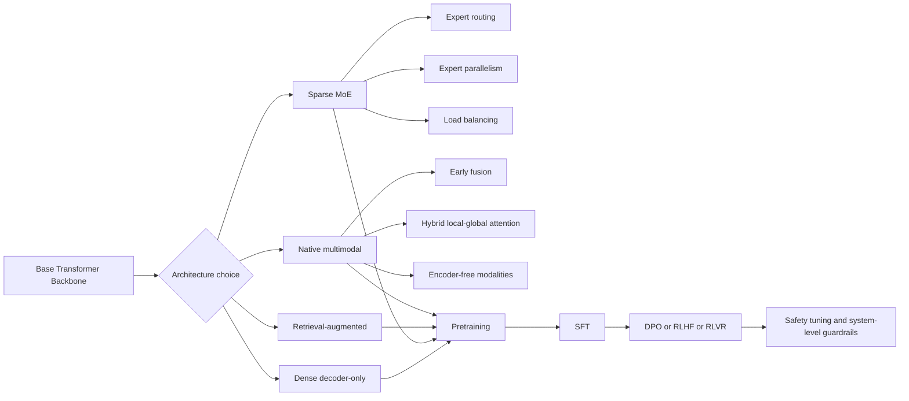
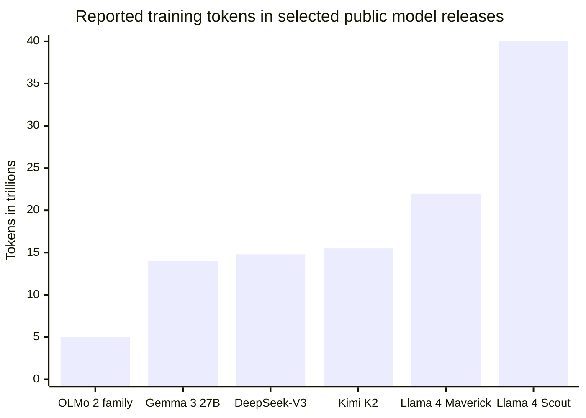
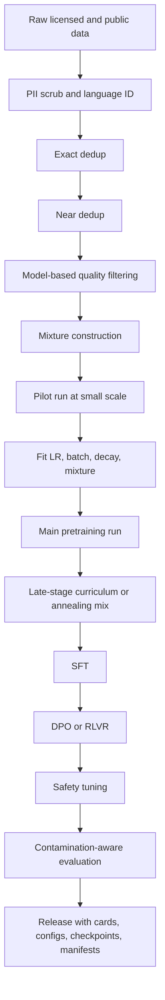

# Research-Level Best Practices for Training Large Language Models in 2026

## Executive summary

As of June 18, 2026, the strongest publicly documented training recipes for large language models are converging on a relatively clear pattern. The dominant frontier architecture is no longer a single dense decoder-only transformer recipe, but a family of variants built around sparse Mixture-of-Experts, long-context attention modifications, native multimodality, and multi-stage post-training. DeepSeek-V3, Llama 4, Kimi K2, Qwen3, Gemma 3, OLMo 2, and Tulu 3 together show the main directions: MoE for compute-efficient scale, hybrid or local-global attention for long context and lower KV-cache cost, early-fusion or encoder-free multimodality, synthetic-plus-human post-training data, and preference optimization or verifiable-reward RL for alignment. The most recent 2026 official releases that continue these patterns are Gemma 4, DeepSeek V4 Preview, and Qwen3.6, although their public training disclosures are still thinner than the 2025 technical reports that remain the strongest primary evidence base. citeturn19view2turn37view2turn19view0turn19view1turn17view2turn17view3turn17view5turn28search0turn28search4turn27search1turn27search2turn27search0

The single most important strategic lesson is still the Chinchilla-style compute-optimal view: under a fixed compute budget, more tokens and somewhat smaller models are usually better than the older “oversize the model, undertrain it” pattern. That principle has not gone away; it has been refined. Newer work adds that hyperparameters themselves now obey useful scaling laws. In particular, recently published “Step Law” results suggest that optimal learning rate scales as a power law of model size and dataset size, while optimal batch size is driven mainly by dataset size and is relatively insensitive to model size; work on AdamW weight decay further suggests that optimal decay should decrease with dataset size and increase with model size when the learning-rate scaling is chosen appropriately. Constant-learning-rate-plus-cooldown schedules also appear easier to reuse across scaling studies than pure cosine schedules. citeturn2search0turn2search1turn31view3turn31view2turn31view4

The strongest evidence on data says that data quality engineering is now at least as important as architecture. Modern best practice is not “use more web text,” but “build a documented, deduplicated, filtered, domain-balanced mixture, then change the mixture late in training.” DataComp-LM shows that model-based filtering is a key lever and that a 7B model trained on the DCLM baseline can reach 64% five-shot MMLU on 2.6T tokens. FineWeb and RefinedWeb show that large, carefully filtered web corpora can outperform older open mixtures, while Dolma and OLMo 2 show the value of transparent open corpora and late-stage curriculum changes. Synthetic data is now a standard instrument, but the safest reading of the latest evidence is to use it as a complement, not a replacement: mixed real-plus-synthetic corpora can improve efficiency, whereas synthetic-only recursion risks model collapse. citeturn32view0turn32view1turn32view4turn32view2turn17view3turn33view0turn32view5turn32view6

On optimization and systems, AdamW remains the most defensible default baseline for research, but it is no longer the only serious option at scale. LAMB is still relevant for very-large-batch training, Adafactor remains attractive when optimizer-state memory is the bottleneck, and Muon-based optimizers have moved from interesting niche to credible frontier option: Qwen researchers report roughly 2× computational efficiency for scalable Muon relative to AdamW in their scaling-law study, and Moonshot’s Kimi K2 demonstrates a MuonClip variant on a trillion-parameter-class MoE with 15.5T tokens and no loss spikes. In system design, the 2026 standard stack is some combination of BF16 or FP8 mixed precision, ZeRO or FSDP-style sharding, tensor/pipeline/context/expert parallelism, activation checkpointing, optimizer-state sharding, communication overlap, and quantization-aware or low-rank post-training where full fine-tuning is unnecessary. citeturn5search0turn5search1turn5search2turn23search8turn19view0turn19view2turn7search0turn7search1turn7search2turn7search7turn36view0turn6search15

Evaluation has become much more rigorous than “report MMLU and HumanEval.” A research-grade training program in 2026 should use a portfolio that covers intrinsic LM quality, difficult knowledge and reasoning benchmarks, coding and agentic tasks, long-context and multimodal tasks, contamination-resistant benchmarks, calibration and robustness, and explicit safety testing. HELM remains the clearest framework for multi-metric evaluation; MMLU-Pro and GPQA were explicitly designed to stay challenging as models improved; LiveBench and LiveCodeBench address contamination with frequent updates and objective scoring; SWE-bench and SWE-bench+ probe real software engineering; SALAD-Bench and SafeBench expand safety evaluation; and Tulu 3’s decontamination-first evaluation recipe is one of the strongest open examples of how to run post-training evaluations without fooling yourself. citeturn8search0turn8search1turn8search2turn25search3turn25search11turn8search7turn8search11turn9search11turn9search3turn17view5

The final meta-lesson is organizational. The best “standard” in 2026 is not just a model recipe but a release discipline: log everything, publish model cards and dataset documentation, retain intermediate checkpoints and exact configs, version the data pipeline and licenses, document safety and red-teaming, and separate benchmark development from benchmark reporting. OLMo 2 is the best current example of this fully open standard; closed frontier labs still rarely disclose enough detail to make their recipes reproducible end to end. citeturn17view3turn10search3turn10search0turn10search1turn10search2

## Synthesis across training dimensions

### Architectures and innovations

The architecture frontier is now best described as a menu of specialized transformer variants rather than a single canonical stack. Sparse MoE is the leading choice when the goal is frontier capability under a bounded training or inference budget. DeepSeek-V3 uses 671B total parameters with 37B activated per token; Llama 4 Scout and Maverick use MoE with 17B activated parameters and 109B/400B total parameters respectively; Kimi K2 uses 1T total parameters with 32B active; and Qwen3 spans both dense and MoE variants up to 235B parameters. The attraction is simple: routed models decouple total parameter count from per-token compute, and scaling-law work on routed language models confirms that performance depends on both total parameters and compute as separate axes rather than one. citeturn19view2turn16view0turn19view0turn19view1turn30search1turn30search5

Within MoE, the main 2025–2026 innovations are not just “more experts,” but how to make them stable and useful. DeepSeek-V3 emphasizes auxiliary-loss-free load balancing and Multi-head Latent Attention plus multi-token prediction; Kimi K2 emphasizes MuonClip and an explicitly agentic post-training pipeline; Llama 4 adds early-fusion multimodality; and Gemma 4 combines dense and MoE releases with hybrid attention and multimodal support. In practice, this means a strong 2026 research stack should treat expert routing, load-balancing losses, and expert parallelism as first-class design problems, not implementation details. citeturn19view2turn19view0turn16view0turn28search4turn34view3

Retrieval remains an important but non-universal branch. RETRO showed that retrieval-augmented pretraining can reach GPT-3/Jurassic-1-class performance on the Pile with 25× fewer parameters by retrieving from a 2T-token database, and Atlas showed that retrieval-augmented models can be surprisingly strong in few-shot knowledge-intensive settings. But the wider industry has not standardized on retrieval-in-pretraining because the system complexity is high. The more durable best practice in 2026 is narrower: if freshness, provenance, or updateability matters, use retrieval augmentation at inference or during continued pretraining; if not, do not assume retrieval is automatically better than a simpler parametric model. citeturn14search1turn14search3turn14search2

Multimodality is no longer optional for flagship releases. Llama 4 is natively multimodal with early fusion. Gemma 3 added vision and longer-context local/global attention changes to reduce KV-cache costs. Gemma 4 extends the pattern further with multimodal open models, up to 256K context, 140+ languages, dense and MoE variants, and audio support on selected models; Google also describes Gemma 4 12B as the first medium-sized encoder-free multimodal model that can natively ingest audio and video. A practical standard for 2026 is therefore to design the backbone and tokenizer/processor stack with multimodal extensibility in mind even if the first research milestone is text-only. citeturn16view0turn17view2turn28search4turn28search2turn28search1

Instruction-tuning has also standardized into a multi-stage recipe. The original InstructGPT result still matters because it showed that a small aligned model can beat a much larger base model on user preference. Today, the dominant variants are supervised fine-tuning followed by DPO-style preference optimization or RL with verifiable rewards, with synthetic instruction generation and preference data used to cover long-tail skills. Tulu 3 and OLMo 2 are especially valuable because they publish both what worked and what did not. citeturn9search0turn9search1turn17view5turn17view3



The diagram reflects the common training flow visible across DeepSeek-V3, Llama 4, Gemma 3/4, Qwen3, OLMo 2, and Tulu 3. citeturn19view2turn16view0turn17view2turn28search4turn19view1turn17view3turn17view5

### Scaling laws and compute-data tradeoffs

The core scaling-law story remains Chinchilla. Kaplan-style scaling laws established the predictive value of power laws for loss versus model size, dataset size, and compute. Hoffmann and colleagues then showed that many existing frontier models were undertrained, arguing for compute-optimal training with much more data and relatively smaller models. That result remains the strongest starting point for research planning in 2026. citeturn2search1turn2search0

What changed in 2024–2026 is that researchers moved from “how should parameters and tokens scale?” to “how should the whole recipe scale?” The strongest recent addition is Step Law: across 3,700 pretraining runs totaling nearly one million H800 GPU-hours and 100T tokens, the authors find that optimal learning rate follows a power law in model size and dataset size, while optimal batch size is driven mainly by dataset size and is largely invariant to model size. This is one of the most useful general findings in the recent literature because it makes small-scale sweeps much more reusable. citeturn31view3

Another useful update is that schedule choice affects how reusable your scaling experiments are. “Scaling Laws and Compute-Optimal Training Beyond Fixed Training Durations” argues that constant learning rate with a cooldown scales predictably and is easier to compare across training lengths than a pure cosine schedule; the same paper also reports gains from stochastic weight averaging without extra training cost. For research teams that are iterating across many pilot runs, this is a real process advantage, not just a minor optimizer detail. citeturn31view2

MoE changes the compute tradeoff but does not void scaling-law reasoning. Unified scaling laws for routed models show that total parameters and per-token compute are separate scaling axes, and later empirical work continues to show large compute advantages for efficient MoE when configured well. The practical lesson is that dense-vs-MoE should be treated as a budget and deployment decision, not just a taste decision. If the aim is maximum benchmark quality per training FLOP, sparse routing is now the mainstream frontier answer; if the aim is clean interpretability, simpler debugging, or smaller-scale academic reproducibility, dense models still have advantages. citeturn30search1turn30search5turn30search2

A second tradeoff now matters almost as much as model size versus tokens: data mixture optimization. Data Mixing Laws and later work on optimal data mixtures show that domain weights can be optimized predictively rather than by intuition, and can produce gains equivalent to substantially longer training. OLMo 2 operationalizes this idea in practice with late-stage curriculum data. This is now a best practice: choose an initial broad mixture, but reserve budget for a late-stage data reweighting or “annealing curriculum” based on development evaluations. citeturn33view0turn32view3turn17view3



This chart uses only publicly disclosed token counts and should be read descriptively, not as a claim that larger token counts always imply a better recipe; data quality and architecture matter just as much. citeturn26search8turn21search2turn39view0turn19view0turn16view0

### Data curation, preprocessing, filtering, synthetic data, and alignment datasets

Data quality engineering is now a primary performance lever. DataComp-LM is especially important because it isolates the effect of filtering and data selection in a controlled benchmark. Its headline conclusion is that model-based filtering is a key ingredient in assembling a high-quality training set, and its baseline lets a 7B model reach 64% five-shot MMLU using 2.6T training tokens. This is a powerful argument that “curation quality” deserves the same rigor as optimizer or architecture work. citeturn32view0

FineWeb and RefinedWeb reinforce the same point from a different angle. RefinedWeb argued that carefully processed web data alone can outperform mixtures that rely on many curated subcorpora. FineWeb scaled this logic to a 15T-token dataset from 96 Common Crawl snapshots and reported better-performing LLMs than earlier open pretraining datasets. The operative best practice is therefore: deduplicate aggressively, filter with stronger heuristics or model-based filters, remove boilerplate and near-duplicates, and keep the curation pipeline versioned and auditable. citeturn32view4turn32view1

Open corpora have also become significantly more mature. Dolma releases an open 3T-token corpus designed for pretraining research, while OLMo 2 builds on open data plus transparent training artifacts and introduces the Dolmino Mix 1124 late-stage curriculum. That combination matters for research because it turns data curation into a repeatable science rather than a black box. citeturn32view2turn17view3

For ongoing training, domain mixing should be treated as an optimization problem, not a hand-tuned ratio. Data Mixing Laws show that mixture weights can be fit from smaller runs and extrapolated, reaching performance comparable to a model trained for 48% more steps on a default mixture. The later “Scaling Laws for Optimal Data Mixtures” result extends that logic to language, multimodal, and vision pretraining, which suggests this principle is broader than text-only LLMs. citeturn33view0turn32view3

Synthetic data has become standard, but the evidence strongly argues against naive recursive use. Synthetic continued pretraining can make domain-specific knowledge much easier to learn; Self-Instruct showed that instruction data can be bootstrapped from the model itself; and newer systematic studies show that certain real-plus-synthetic mixtures can accelerate training at large budgets. At the same time, synthetic-only recursion risks model collapse, and the most recent scaling-law study on synthetic pretraining finds that rephrased synthetic data alone is not faster than natural web text, while a one-third synthetic / two-thirds natural mixture can improve efficiency and textbook-only synthetic corpora can hurt broad downstream quality. The conservative research standard in 2026 is therefore: use synthetic data tactically, keep a substantial real-data anchor, and measure contamination and collapse risk explicitly. citeturn33view1turn4search0turn32view5turn32view6

For alignment data, the best current open pattern is multi-source, decontaminated, and verifier-aware. UltraFeedback provides broad preference signals; InstructGPT establishes the supervised-demonstration-plus-ranked-preferences template; DPO simplifies preference optimization; Constitutional AI shows that AI feedback can partially replace human comparison labeling for harmlessness; and Tulu 3 adds substantial dataset decontamination plus RL with verifiable rewards. For math, code, tool use, and agent-like tasks, verifier-backed preference or RL data is now preferable to purely subjective preference labeling whenever possible. citeturn4search1turn9search0turn9search1turn9search2turn17view5

### Optimization algorithms and hyperparameter schedules

AdamW remains the default optimizer to beat because it is robust, widely implemented, and well understood. OLMo and many open recipes use AdamW with betas around 0.9 and 0.95 and epsilon around 1e-5, which remains a strong baseline for dense transformer pretraining. The weight-decay scaling work from 2024 is particularly helpful here: it suggests holding the effective EMA timescale roughly constant across scales, which implies decreasing weight decay as dataset size increases and increasing it as model size increases, given appropriate learning-rate scaling. citeturn22search1turn31view4

LAMB and Adafactor still have specific but important niches. LAMB was designed for very large batch training and remains relevant whenever you want to push global batch size much higher without destabilizing optimization. Adafactor trades some optimizer flexibility for much lower memory use via factored second moments, which still makes it useful for memory-constrained setups and some encoder-decoder or continued-pretraining workloads. For pure frontier autoregressive pretraining, however, AdamW remains the most defensible research baseline unless there is a compelling resource reason to switch. citeturn5search1turn5search2turn5search0

What changed most recently is the credibility of Muon-style optimizers for LLM pretraining. “Muon is Scalable for LLM Training” reports that with weight decay and careful update scaling, Muon works out of the box at larger scales and achieves about 2× computational efficiency relative to AdamW under compute-optimal training. Kimi K2 then turns that from a paper result into a flagship-model case study with MuonClip, 15.5T tokens, and zero reported loss spikes. This does not mean AdamW should be abandoned; it does mean that large research teams should now treat “AdamW versus Muon-family” as a serious experimental branch, especially for MoE pretraining. citeturn23search8turn19view0

Learning-rate schedules are no longer a trivial afterthought. Older open recipes and many production stacks still use linear warmup followed by cosine decay, and OLMo shows concrete end-task gains from decaying LR to zero in the final 1,000 steps. But the newer evidence suggests that constant LR plus cooldown is often easier to scale and compare across experiments. For research teams, the practical standard is a two-step process: use constant-LR-plus-cooldown or a simple cosine baseline during scaling studies, then lock the schedule before the final large run rather than letting schedule choice drift across ablations. citeturn31view1turn31view2

Batch size should now be selected with empirical scaling evidence rather than folklore. Step Law suggests optimal batch is mainly a function of dataset size rather than model size. Smaller open recipes often work in the low millions of tokens per optimizer step; OLMo’s reported global batches were about 4M tokens for smaller models and warmed up much higher for larger ones. In practical terms, gradient accumulation is a system workaround, not a conceptual substitute: choose a target global token batch based on the data regime, then use accumulation to realize that batch on available hardware. citeturn31view3turn22search0turn22search12

### Efficient training methods, parallelism, and memory-IO optimization

The systems frontier is now defined by joint algorithm-framework-hardware co-design. DeepSeek-V3 is the clearest case study: it combines FP8 mixed precision, communication-computation overlap, and MoE communication optimizations to train a 671B/37B-active model on 14.8T tokens with 2.788M H800 GPU-hours, while reporting no irrecoverable loss spikes or rollbacks. In other words, modern training efficiency is not a single trick but a stack of mutually reinforcing system choices. citeturn39view0turn19view2

For distributed training, the best-supported research stack today is Megatron-Core or a comparable framework for tensor, pipeline, context, and expert parallelism, with FSDP2 or ZeRO-style sharding for parameters, gradients, and optimizer state. NVIDIA’s current Megatron-Core documentation explicitly recommends 3D or 4D combinations of tensor, pipeline, context, and expert parallelism for large dense and MoE models, and notes that sequence parallelism is required when tensor parallelism is combined with expert parallelism. PyTorch FSDP2 formalizes the alternative sharded-data-parallel path for eager-mode training, while DeepSpeed ZeRO-3 and ZeRO-Infinity remain the canonical offload/sharding references. citeturn7search0turn7search1turn7search2turn7search4turn7search7

Quantization-aware training has moved from a deployment trick to part of the mainstream efficiency toolbox. Google’s Gemma 3 QAT release is a concrete example: after about 5,000 QAT steps using the non-quantized checkpoint as a target, the team reports reducing the perplexity drop from Q4_0 quantization by 54%, and shrinking the 27B model’s raw weight VRAM requirement from 54 GB in BF16 to 14.1 GB in int4, enough to fit on an RTX 3090. That result is not about pretraining cost directly, but it is extremely relevant for post-training, evaluation, and local research iteration. citeturn36view0

Low-rank adaptation remains the default way to fine-tune when full-parameter updates are not essential. The original LoRA paper showed that low-rank updates can dramatically reduce trainable parameter counts while matching full fine-tuning on many tasks, and current framework docs from Google, NVIDIA, and Hugging Face all treat PEFT-style training as a first-class workflow. The research standard in 2026 is straightforward: use full fine-tuning for base pretraining or when studying optimization itself; use LoRA-style adapters for most instruction tuning, domain transfer, and ablation-heavy experiments unless a full update is clearly required. citeturn6search15turn7search11turn35view2

For low-precision pretraining itself, FP8 is now credible at frontier scales, though not yet “free.” FP8-LM reports a 39% real memory reduction and 75% speedup versus a BF16 baseline during GPT-175B training on H100s, while DeepSeek-V3 validates FP8 on a very large MoE. The implication is that BF16 is still the safe default, but FP8 should now be considered a mainstream research option whenever the framework and hardware stack are mature enough. citeturn23search3turn39view0

### Evaluation, benchmarks, robustness, calibration, and safety

The benchmark regime that sufficed in 2023 is not enough in 2026. MMLU remains useful, but it is no longer discriminative by itself. MMLU-Pro was designed to be more reasoning-heavy and less noisy by expanding answer choices and removing trivial items. GPQA was explicitly built by domain experts to be “Google-proof,” with experts scoring around 65% and strong non-expert validators scoring only 34%. These are now much better anchors for knowledge and reasoning claims than plain MMLU alone. citeturn8search1turn8search2

Contamination-aware evaluation is now a hard requirement for serious training work. LiveBench provides frequently updated, contamination-resistant tasks with objective scoring and monthly updates; LiveCodeBench does the same for coding competitions; SWE-bench and SWE-bench+ move from toy code generation to real repository issues, with SWE-bench+ explicitly addressing the leakage problem in the original benchmark. A credible research report should therefore distinguish between static legacy benchmarks and contamination-resistant benchmarks, and should prioritize the latter for headline claims. citeturn25search3turn25search11turn8search7turn8search11

A mature evaluation pipeline must also be multi-metric. HELM remains exemplary because it measures not only accuracy but also calibration, robustness, fairness, bias, toxicity, and efficiency across many scenarios. This matters because single-metric optimization can improve apparent capability while worsening deployment-relevant properties. In 2026, “best practice” evaluation means at least one multi-metric lens like HELM or an equivalent internal taxonomy, not just a leaderboard sweep. citeturn8search0

For alignment and safety, current best practice is layered. Model-level alignment uses supervised data, preferences, DPO or RLHF/RLAIF, and targeted safety tuning; system-level alignment adds classifiers, prompt defenses, output filters, and use-case-specific policies. Meta’s Llama 4 documentation is unusually explicit that the model should not be deployed in isolation and that system protections such as Llama Guard, Prompt Guard, and Code Shield should be used in context. Benchmarks like SALAD-Bench and SafeBench extend this philosophy into structured measurement. citeturn16view0turn9search11turn9search3

### Reproducibility, documentation, tooling, infrastructure, and cost

The strongest reproducibility standard currently visible in the open literature is the OLMo line. OLMo 2 releases model weights, full training data, training code and recipes, training logs, and thousands of intermediate checkpoints. That is far beyond the norm for frontier models, and it should be treated as the reference-quality standard for academic and industrial research teams that care about reproducibility. citeturn17view3turn10search3

At minimum, a research-grade project in 2026 should retain and version: tokenizer and special tokens; exact model config; optimizer config; LR schedule; sampling-temperature and data-mixing specs; per-source data manifests and hashes; deduplication rules; licenses; evaluation harness version; seed management; intermediate checkpoints; and, if possible, optimizer states and RNG states for restarts. Model cards and dataset documentation are no longer optional extras: they are the minimal layer that makes model release, internal audit, and downstream use intelligible. citeturn10search0turn10search1turn10search2turn7search8

The tooling landscape has also matured into a relatively opinionated stack. Megatron-Core and NeMo Megatron Bridge are strong choices for large-scale dense/MoE pretraining and conversion workflows; FSDP2 is PyTorch’s current mainstream sharded-training path; DeepSpeed remains important for ZeRO-style partitioning and offload; and lm-evaluation-harness has become the default open evaluation spine for standardized few-shot and leaderboard-style benchmarking. For smaller or more heterogeneous research groups, the key principle is not to standardize on one vendor, but to standardize on a reproducible launcher, config format, checkpoint format, and evaluation harness. citeturn7search4turn7search7turn7search1turn7search2turn25search0turn25search12

Indicative compute cost remains enormous even with efficient recipes. Public Lambda Cloud pricing lists H100 instances at $3.99 per GPU-hour, implying a lower-bound rental-equivalent of about $3.99M per million H100 GPU-hours. Using that rough rate, Meta’s disclosed 7.38M H100 GPU-hours for Llama 4 pretraining corresponds to about $29.4M in raw GPU rental equivalent, while DeepSeek-V3’s 2.788M GPU-hours correspond to about $11.1M if priced at the same H100 rate; that second figure is only a rough analog because DeepSeek used H800s, not H100s, and real total cost also includes networking, storage, engineering time, checkpointing overhead, power, and failed runs. The practical lesson is that compute efficiency in 2026 is measured in single-digit millions of GPU-hours for flagship training, not thousands. citeturn12search3turn29calculator2turn16view0turn29calculator1turn39view0turn29calculator0

### Ethical and legal considerations

Ethical and legal constraints have become part of the training standard itself, not a post-hoc compliance layer. In the EU, obligations for providers of general-purpose AI models entered into application on August 2, 2025, and the Commission’s GPAI code of practice and related guidance are explicitly intended to help providers comply with the AI Act. By August 2, 2026, the majority of AI Act rules start applying and enforcement begins. For research teams operating in or serving the EU, this turns documentation, risk identification, copyright handling, and transparency from “good practice” into something much closer to operational necessity. citeturn11search0turn11search3turn11search4

In the United States, the Copyright Office’s 2025 report on generative AI training makes clear that training on copyrighted material is now a major live policy issue, even though the legal landscape is still unsettled. The safest operational stance for 2026 is therefore to maintain provenance records, licensing metadata, removal pathways, and a defensible account of how copyrighted or restricted data was handled. Research teams should not build pipelines that they cannot later explain source by source. citeturn11search1turn11search5

Risk management frameworks have also become more concrete. NIST’s AI RMF and Generative AI Profile provide a structured way to operationalize risk identification, mitigation, and monitoring. For training teams, that should translate into explicit risk registers for data sources, memorization and privacy leakage tests, red-teaming plans, hazardous-capability reviews, harmful-output metrics, and post-release monitoring plans. The most mature model cards in 2026 increasingly combine technical, safety, and environmental reporting in one place. citeturn11search2turn11search6turn16view0

## Comparative tables of leading models and papers

### Leading publicly documented model and training reports

| Model or release | Year | Architecture and scale | Data and compute disclosure | Key innovations | Headline reported performance | Why it matters for best practice |
|---|---:|---|---|---|---|---|
| DeepSeek-V3 | 2024 | MoE, 671B total / 37B active, 128K context | 14.8T tokens; 2.788M H800 GPU-hours full training | MLA, auxiliary-loss-free MoE load balancing, multi-token prediction, FP8 large-scale training, comm/compute overlap | 64.4 MMLU-Pro base; 75.9 MMLU-Pro instruct; 59.1 GPQA-Diamond; 37.6 LiveCodeBench; 42.0 SWE Verified; 90.2 MATH-500; 85.5 Arena-Hard; 70.0 AlpacaEval 2.0 length-controlled citeturn39view0 | Most complete frontier MoE systems report with strong evidence on scalable FP8 and efficient sparse training. citeturn39view0turn19view2 |
| Llama 4 Maverick and Scout | 2025 | Native multimodal MoE; Scout 17B active / 109B total, Maverick 17B active / 400B total | Scout ~40T tokens, Maverick ~22T; total 7.38M H100 GPU-hours across Scout + Maverick | Early-fusion multimodality, long context, quantization-ready release, strong official benchmark disclosure | Maverick: 80.5 MMLU Pro, 69.8 GPQA Diamond, 43.4 LiveCodeBench, 73.4 MMMU, 73.7 MathVista; Scout: 74.3 MMLU Pro, 57.2 GPQA Diamond, 32.8 LiveCodeBench citeturn37view2turn37view3turn16view0 | Best official open model card for MoE multimodal benchmarking and disclosed H100 training footprint. citeturn16view0turn37view2 |
| Kimi K2 | 2025 | MoE, 1T total / 32B active | 15.5T tokens | MuonClip optimizer, large-scale agentic data synthesis, joint RL in real and synthetic environments | 66.1 Tau2-Bench, 76.5 ACEBench En, 65.8 SWE-Bench Verified, 47.3 SWE-Bench Multilingual, 53.7 LiveCodeBench v6, 75.1 GPQA-Diamond, 49.5 AIME 2025 citeturn19view0 | Strongest open evidence that optimizer innovation plus agentic post-training can move frontier coding and agent performance. citeturn19view0 |
| Qwen3 | 2025 | Dense and MoE family from 0.6B to 235B | Public release under Apache 2.0; abstract emphasizes efficiency and multilinguality | Unified thinking and non-thinking modes, thinking budget, multilingual expansion to 119 languages | State-of-the-art across code, math, and agent tasks versus larger MoE and proprietary models, per report abstract citeturn19view1 | Important because it reframes “reasoning model versus chat model” as one unified framework. citeturn19view1 |
| Gemma 3 | 2025 | Multimodal dense family from 1B to 27B, at least 128K context | 27B trained on 14T tokens | More local than global attention to reduce KV cache, distillation-heavy recipe, stronger post-training | Gemma3-27B reported comparable to Gemini-1.5-Pro across benchmarks; 4B-IT competitive with Gemma2-27B-IT citeturn17view2turn21search2 | Strong public evidence for small-to-mid-scale long-context multimodal design and post-training efficiency. citeturn17view2turn21search2 |
| OLMo 2 | 2025 | Dense autoregressive family at 7B, 13B, 32B | Fully released weights, training data, code, recipes, logs, many checkpoints | Transparent end-to-end release, late-stage Dolmino curriculum, Tulu 3-style post-training, RLVR | Report says Pareto frontier vs compute for open models; official blog says 32B is first fully open model to outperform GPT-3.5 Turbo and GPT-4o mini on a multi-skill academic suite citeturn17view3turn26search14 | Best reproducibility standard in current open LLM research. citeturn17view3turn10search3 |
| Tulu 3 | 2024/2025 | Post-training recipe on Llama 3.1 bases up to 405B | Releases complete recipe, data, training code, curation and evaluation tooling | SFT + DPO + RLVR, strong decontamination and open post-training analysis | Surpasses Llama 3.1 instruct, Qwen2.5, Mistral, GPT-4o-mini, Claude 3.5 Haiku in its reported comparisons citeturn17view5 | Best open post-training blueprint now available. citeturn17view5 |
| Mixtral 8x7B | 2024 | Sparse MoE, 47B total / 13B active | 32K context | 2-of-8 expert routing at each layer, open Apache 2.0 release | Matches or outperforms Llama 2 70B and GPT-3.5 on evaluated benchmarks; instruct version surpasses GPT-3.5 Turbo, Claude 2.1, Gemini Pro, and Llama 2 70B chat on human benchmarks citeturn17view4 | Important historical inflection point for open sparse models. citeturn17view4 |

A final frontier note is necessary for freshness. As of June 18, 2026, official current open releases also include Gemma 4, DeepSeek V4 Preview, and Qwen3.6. Gemma 4 adds multimodal open models with up to 256K context, 140+ languages, and both dense and MoE variants; DeepSeek V4 Preview advertises 1.6T total parameters, 49B active parameters, and 1M context; Qwen3.6 is officially positioned as the latest Qwen addition, optimized for stability and real-world utility. These releases are relevant for current trend-tracking, but they do not yet have the same level of public training-report detail as the strongest 2025 sources above. citeturn28search0turn28search4turn28search2turn27search1turn27search3turn27search0turn27search2

### Core papers that most directly shape 2026 best practice

| Paper or framework | Main contribution | Practical implication for training teams |
|---|---|---|
| Chinchilla and earlier neural scaling laws | Compute-optimal training favors more data and less undertraining than old frontier practice. citeturn2search0turn2search1 | Start budgeting from compute-optimal token counts, not just parameter count. |
| Step Law | Optimal LR scales with model and dataset size; optimal batch is mostly driven by dataset size. citeturn31view3 | Run small sweeps once, then extrapolate instead of re-tuning from scratch at every scale. |
| Constant LR plus cooldown | Predictable scaling experiments and reusable training runs. citeturn31view2 | Prefer simple schedules for scaling research; reserve bespoke schedules for final runs. |
| AdamW decay scaling | Weight decay should fall with dataset size and rise with model size under appropriate LR scaling. citeturn31view4 | Tune weight decay as a scale-dependent quantity, not a constant copied from old recipes. |
| DataComp-LM | Model-based filtering is a key driver of pretraining data quality. citeturn32view0 | Invest in filtering, deduplication, and data scoring infrastructure early. |
| Data Mixing Laws and optimal mixture scaling | Mixture weights can be predicted and optimized rather than guessed. citeturn33view0turn32view3 | Treat the data mixture as an optimization variable and update it late in training. |
| RefinedWeb and FineWeb | Large-scale filtered web data can outperform earlier open corpora. citeturn32view4turn32view1 | Do not over-romanticize tiny curated sets; scalable web curation still works. |
| Synthetic-data scaling and collapse papers | Synthetic data helps in mixtures, but synthetic-only recursion is unsafe. citeturn32view5turn32view6 | Keep a real-data anchor; measure collapse and contamination risk explicitly. |
| InstructGPT, DPO, Constitutional AI, Tulu 3 | Modern instruction following comes from staged post-training and preference optimization. citeturn9search0turn9search1turn9search2turn17view5 | Standardize on SFT plus DPO or RLVR/RLHF; add constitutional or AI feedback when needed. |
| ZeRO, FSDP2, Megatron-Core | Modern sharding and parallelism are integral to feasible large-scale training. citeturn7search2turn7search1turn7search0 | Build around sharding and parallelism from day one, not as a rescue patch later. |
| Muon scaling and Kimi K2 | Muon-family optimizers are now credible at scale. citeturn23search8turn19view0 | Benchmark AdamW against Muon-family optimizers for large MoE pretraining. |

## Best-practice checklist for research teams

| Area | Recommended default standard in 2026 | Evidence anchor |
|---|---|---|
| Architecture selection | Start dense for smaller interpretability-focused studies; switch to MoE when the objective is top performance per training FLOP; make multimodal extensibility a planned backbone feature. | DeepSeek-V3, Llama 4, Kimi K2, Qwen3, Gemma 3/4 citeturn19view2turn16view0turn19view0turn19view1turn17view2turn28search4 |
| Scaling plan | Budget by compute-optimal token count first; run pilot sweeps at smaller scale; fit LR and batch trends before the main run. | Chinchilla, Step Law, constant-LR/cooldown citeturn2search0turn31view3turn31view2 |
| Data pipeline | Maintain per-source manifests, near-duplicate removal, model-based filtering, license tracking, and a late-stage curriculum reweighting plan. | DataComp-LM, FineWeb, OLMo 2, Data Mixing Laws citeturn32view0turn32view1turn17view3turn33view0 |
| Synthetic data | Use synthetic data as a targeted accelerator or domain augmenter, not as the sole training diet; keep real-data anchors. | Synthetic-data scaling and collapse papers citeturn32view5turn32view6 |
| Base optimizer | AdamW as baseline; LAMB only when pushing very large batches; Adafactor when memory dominates; Muon-family as a serious large-scale alternative. | AdamW, LAMB, Adafactor, Muon, Kimi K2 citeturn5search0turn5search1turn5search2turn23search8turn19view0 |
| Schedule | Warm up briefly, then use either cosine decay or constant LR plus cooldown; prefer the latter for scaling studies; explicitly tune weight decay with scale. | OLMo, beyond-fixed-duration scaling, AdamW weight-decay scaling citeturn31view1turn31view2turn31view4 |
| Precision | BF16 as safe default; FP8 when the framework-hardware stack is mature enough and large-scale validation exists; QAT for deployable low-bit post-training. | DeepSeek-V3, FP8-LM, Gemma 3 QAT citeturn39view0turn23search3turn36view0 |
| Distributed training | Choose one reproducible sharding and parallelism stack early: Megatron-Core or FSDP2 or ZeRO-based, with checkpointing standardized from the start. | Megatron-Core, FSDP2, ZeRO docs citeturn7search0turn7search1turn7search2 |
| Post-training | Use staged SFT, then DPO or RLVR/RLHF; prefer verifier-backed rewards for math, code, and tool use. | InstructGPT, DPO, Tulu 3, OLMo 2 citeturn9search0turn9search1turn17view5turn17view3 |
| Evaluation | Use intrinsic LM metrics plus contamination-resistant knowledge, coding, agentic, safety, and calibration benchmarks; decontaminate datasets. | HELM, MMLU-Pro, GPQA, LiveBench, LiveCodeBench, SWE-bench+, Tulu 3 citeturn8search0turn8search1turn8search2turn25search3turn25search11turn8search11turn17view5 |
| Documentation | Release or internally retain configs, data manifests, licenses, logs, intermediate checkpoints, model cards, and dataset cards. | OLMo 2, model cards, datasheets, data cards citeturn17view3turn10search0turn10search1turn10search2 |
| Safety and governance | Do model-level safety tuning, system-level guardrails, adversarial red-teaming, and legal provenance review before release. | Llama 4 safeguards, SALAD-Bench, SafeBench, EU AI Act, NIST AI RMF citeturn16view0turn9search11turn9search3turn11search0turn11search2 |

## Reproducible experiment template

The template below is a synthesis of the most reproducible open practices visible in OLMo/OLMo 2, Tulu 3, Chinchilla-style compute planning, Step Law-style hyperparameter scaling, and modern systems stacks such as Megatron-Core, FSDP2, and ZeRO. It is deliberately conservative: it aims to be a strong research default, not an exotic frontier recipe. citeturn17view3turn17view5turn2search0turn31view3turn7search0turn7search1turn7search2

```yaml
project:
  name: llm_pretrain_repro_2026
  seed: 42
  notes: "Dense baseline first; MoE branch only after dense controls are stable."

model:
  family: decoder_only_transformer
  variant: dense_baseline
  params_target: 13B
  n_layers: 40
  d_model: 5120
  n_heads: 40
  n_kv_heads: 8
  ffw: swiglu
  rope: true
  rmsnorm: true
  context_length: 8192
  attention:
    type: hybrid_local_global
    local_window: 4096
  tokenizer:
    vocab_size: 128000
    byte_fallback: true

data:
  manifest_version: v1
  sources:
    - filtered_web
    - code
    - books
    - papers
    - wiki
    - math
    - multilingual
  preprocessing:
    pii_scrub: true
    language_id: true
    exact_dedup: true
    near_dedup: true
    boilerplate_filter: true
    model_based_quality_filter: true
    toxic_filter: thresholded
  mixture:
    initial:
      filtered_web: 0.52
      code: 0.16
      books: 0.08
      papers: 0.08
      wiki: 0.06
      math: 0.05
      multilingual: 0.05
    late_stage_curriculum:
      enabled: true
      start_fraction_of_tokens: 0.80
      target_mix: "higher-quality, domain-balanced, eval-informed"
  packing:
    sequence_packing: true
    target_utilization: 0.97

training:
  objective: next_token_prediction
  optional_auxiliary:
    multi_token_prediction: false   # turn on for dedicated ablation branch
  tokens_target: 3T
  optimizer:
    name: adamw
    lr_peak: "fit from pilot sweeps"
    betas: [0.9, 0.95]
    eps: 1.0e-5
    weight_decay: "scale with model/data, do not keep fixed across runs"
  schedule:
    warmup_steps: 2000
    main_phase: constant_lr
    cooldown:
      enabled: true
      final_fraction: 0.05
      end_lr: 0.0
  batching:
    global_tokens_per_step: 4M
    micro_batch_per_gpu: "maximize memory safely"
    gradient_accumulation: "set from hardware to realize global batch"
  stability:
    grad_clip_norm: 1.0
    anomaly_hooks: true
    loss_spike_watchdog: true
    checkpoint_every_steps: 500
    eval_every_steps: 1000

precision_and_systems:
  precision: bf16
  fp8_branch: optional
  activation_checkpointing: true
  sharding: fsdp2_or_zero3
  parallelism:
    tensor_parallel: 2
    pipeline_parallel: 2
    context_parallel: 1
    expert_parallel: 1
  overlap_comm_compute: true
  fused_kernels: true

post_training:
  sft:
    enabled: true
    data:
      - human_instructions
      - synthetic_instructions
      - verifier_generated_tooluse
    decontaminate_against_eval: true
  preference_optimization:
    method: dpo
    rlvr_branch: optional
  safety:
    adversarial_data: true
    refusal_tone_eval: true
    system_guardrails_eval: true

evaluation:
  intrinsic:
    - validation_perplexity
    - bits_per_byte
  knowledge_reasoning:
    - mmlu
    - mmlu_pro
    - gpqa
  coding:
    - humaneval
    - livecodebench
    - swe_bench_plus
  robustness_alignment:
    - helm_slice
    - ifeval
    - toxicity
    - calibration
  contamination_controls:
    holdout_hashes: true
    timestamped_benchmarks: true

release:
  artifacts:
    - weights
    - tokenizer
    - configs
    - logs
    - intermediate_checkpoints
    - training_data_manifest
    - licenses
    - model_card
    - dataset_cards
```

A practical way to run this template is to start with a 1B or 3B pilot, fit the data mixture and Step-Law-style hyperparameters, then scale to the target model. If the target is a frontier MoE, the safest research progression is dense baseline first, then a matched-compute sparse branch with expert parallelism and an optimizer comparison between AdamW and a Muon-family variant. citeturn31view3turn17view3turn23search8turn19view0



## Open problems and research directions

The first open problem is optimizer science. AdamW is still the strongest general baseline, but the recent Muon-family evidence suggests that a real optimizer shift may be underway for large-scale LLM pretraining. What is still missing is broad, independently replicated evidence across dense, MoE, multimodal, and retrieval-augmented settings under standardized budgets and open code. citeturn23search8turn19view0

The second open problem is data provenance at frontier scale. The community has improved dramatically on filtering and deduplication, but legal provenance, multilingual rights management, and mechanically auditable data-removal paths remain much weaker than architecture and optimization practice. This gap is becoming more serious as GPAI obligations in the EU and copyright scrutiny in the U.S. harden. citeturn11search0turn11search4turn11search1turn11search5

The third open problem is evaluation under continued rapid model improvement. Benchmarks such as MMLU-Pro, GPQA, LiveBench, LiveCodeBench, and SWE-bench+ are much better than older static suites, but the field still lacks a universally accepted, contamination-resistant, multi-metric benchmark bundle that covers reasoning, tool use, coding, multimodality, long context, calibration, and safety together. HELM remains conceptually strong, but the operational burden of maintaining that breadth is high. citeturn8search1turn8search2turn25search3turn25search11turn8search11turn8search0

The fourth open problem is how far retrieval, synthetic data, and agentic environment interaction should be pushed into pretraining itself rather than post-training. RETRO and Atlas showed the promise of retrieval-augmented pretraining; newer synthetic-data and agentic-training results show strong benefits in continued pretraining and post-training; but the field still lacks a clean consensus on when these mechanisms should be core to the base model versus layered on top. citeturn14search1turn14search3turn33view1turn19view0

### Open questions and limitations

This report prioritizes primary sources and official model documentation, so it deliberately gives less weight to closed frontier systems whose training details are not public. It also treats very recent 2026 releases such as Gemma 4, DeepSeek V4 Preview, and Qwen3.6 more cautiously than 2025 reports because their public methodological detail is currently thinner. Where exact benchmark numbers or full training recipes were not publicly disclosed in the primary source, the report avoided filling the gap with secondary speculation. citeturn28search4turn27search1turn27search2turn17view3

## Prioritized references

The following references are the highest-leverage starting set for a research team building or revising an LLM training stack in 2026.

1. Hoffmann et al., **Training Compute-Optimal Large Language Models**. Still the core compute/data budgeting paper. citeturn2search0  
2. Kaplan et al., **Scaling Laws for Neural Language Models**. The foundational scaling-law baseline. citeturn2search1  
3. Li et al., **Predictable Scale Part I Step Law**. Best current primary source on hyperparameter scaling in LLM pretraining. citeturn31view3  
4. Hägele et al., **Scaling Laws and Compute-Optimal Training Beyond Fixed Training Durations**. Best current source on constant-LR-plus-cooldown and reusable scaling studies. citeturn31view2  
5. Wang and Aitchison, **How to set AdamW’s weight decay as you scale model and dataset size**. Most useful recent optimizer hyperparameter paper for large-scale training. citeturn31view4  
6. DeepSeek-AI, **DeepSeek-V3 Technical Report** and official model card. Frontier MoE systems reference with unusually detailed performance and efficiency reporting. citeturn19view2turn39view0  
7. Meta, **Llama 4 model card**. Strong official source for multimodal MoE design, benchmark reporting, and disclosed H100 training footprint. citeturn16view0turn37view2  
8. Kimi Team, **Kimi K2: Open Agentic Intelligence**. Best current open source on MuonClip and agentic post-training. citeturn19view0  
9. Team OLMo, **OLMo 2**. Strongest fully open reproducibility reference. citeturn17view3turn10search3  
10. Lambert et al., **Tulu 3**. Best open post-training recipe and evaluation discipline. citeturn17view5  
11. Li et al., **DataComp-LM**. Best controlled evidence on data filtering and curation. citeturn32view0  
12. Penedo et al., **FineWeb** and **RefinedWeb**. Best large-scale open evidence on high-quality web pretraining corpora. citeturn32view1turn32view4  
13. Ouyang et al., **InstructGPT**; Rafailov et al., **DPO**; Bai et al., **Constitutional AI**. Core alignment sequence. citeturn9search0turn9search1turn9search2  
14. Liang et al., **HELM**. Best multi-metric evaluation framework paper. citeturn8search0  
15. White et al., **LiveBench**; Jain et al., **LiveCodeBench**; Rein et al., **GPQA**; MMLU-Pro. Best current benchmark set for reasoning and contamination-aware evaluation. citeturn25search3turn25search11turn8search2turn8search1  
16. PyTorch FSDP2 docs, DeepSpeed ZeRO docs, Megatron-Core docs. Core systems references for distributed training in 2026. citeturn7search1turn7search2turn7search0  
17. Mitchell et al., **Model Cards** and Gebru et al., **Datasheets for Datasets**. Still the baseline reporting standards. citeturn10search0turn10search1  
18. European Commission GPAI guidance and NIST AI RMF Generative AI Profile. The most relevant current governance anchors for training teams. citeturn11search0turn11search3turn11search2turn11search6